R Notebook
================

# Block 1 Assignment

Liu Nuozhi

## Setup

``` r
library(tidyverse)
library(skimr)
library(ggplot2)
library(e1071)
library(lubridate)
```

``` r
sales <- readRDS(here::here("data/sales.rds"))
```

``` r
sales %>% glimpse()
```

    ## Observations: 79,100
    ## Variables: 11
    ## $ month               <date> 2015-01-01, 2015-01-01, 2015-01-01, 2015-01-01...
    ## $ town                <chr> "ANG MO KIO", "ANG MO KIO", "ANG MO KIO", "ANG ...
    ## $ flat_type           <fct> 3 ROOM, 3 ROOM, 3 ROOM, 3 ROOM, 3 ROOM, 3 ROOM,...
    ## $ block               <chr> "174", "541", "163", "446", "557", "603", "709"...
    ## $ street_name         <chr> "ANG MO KIO AVE 4", "ANG MO KIO AVE 10", "ANG M...
    ## $ storey_range        <fct> 07 TO 09, 01 TO 03, 01 TO 03, 01 TO 03, 07 TO 0...
    ## $ floor_area_sqm      <dbl> 60, 68, 69, 68, 68, 67, 68, 68, 67, 68, 67, 68,...
    ## $ flat_model          <fct> Improved, New Generation, New Generation, New G...
    ## $ lease_commence_date <dbl> 1986, 1981, 1980, 1979, 1980, 1980, 1980, 1981,...
    ## $ remaining_lease     <dbl> 70, 65, 64, 63, 64, 64, 64, 65, 62, 69, 60, 64,...
    ## $ resale_price        <dbl> 255000, 275000, 285000, 290000, 290000, 290000,...

## Question 1

Summarize the different continuous variables (area, price, remaining
lease) as well as the nominal/ordinal variables (month, flat\_type,
town, flat\_model, storey\_range), summarize these variables in both
table (stats on central tendency and distribution) and visual form.

``` r
# summarize these variables in stats
skim(sales)
```

|                                                  |       |
| :----------------------------------------------- | :---- |
| Name                                             | sales |
| Number of rows                                   | 79100 |
| Number of columns                                | 11    |
| \_\_\_\_\_\_\_\_\_\_\_\_\_\_\_\_\_\_\_\_\_\_\_   |       |
| Column type frequency:                           |       |
| character                                        | 3     |
| Date                                             | 1     |
| factor                                           | 3     |
| numeric                                          | 4     |
| \_\_\_\_\_\_\_\_\_\_\_\_\_\_\_\_\_\_\_\_\_\_\_\_ |       |
| Group variables                                  | None  |

Data summary

**Variable type: character**

| skim\_variable | n\_missing | complete\_rate | min | max | empty | n\_unique | whitespace |
| :------------- | ---------: | -------------: | --: | --: | ----: | --------: | ---------: |
| town           |          0 |              1 |   5 |  15 |     0 |        26 |          0 |
| block          |          0 |              1 |   1 |   4 |     0 |      2234 |          0 |
| street\_name   |          0 |              1 |   7 |  20 |     0 |       528 |          0 |

**Variable type: Date**

| skim\_variable | n\_missing | complete\_rate | min        | max        | median     | n\_unique |
| :------------- | ---------: | -------------: | :--------- | :--------- | :--------- | --------: |
| month          |          0 |              1 | 2015-01-01 | 2018-12-01 | 2017-03-01 |        48 |

**Variable type: factor**

| skim\_variable | n\_missing | complete\_rate | ordered | n\_unique | top\_counts                                    |
| :------------- | ---------: | -------------: | :------ | --------: | :--------------------------------------------- |
| flat\_type     |          0 |              1 | FALSE   |         7 | 4 R: 32476, 3 R: 20187, 5 R: 19189, EXE: 6337  |
| storey\_range  |          0 |              1 | FALSE   |        17 | 04 : 18618, 07 : 17223, 10 : 15086, 01 : 14456 |
| flat\_model    |          0 |              1 | FALSE   |        21 | Mod: 24184, Imp: 20017, New: 12325, Pre: 8250  |

**Variable type: numeric**

| skim\_variable        | n\_missing | complete\_rate |      mean |        sd |     p0 |    p25 |    p50 |    p75 |    p100 | hist  |
| :-------------------- | ---------: | -------------: | --------: | --------: | -----: | -----: | -----: | -----: | ------: | :---- |
| floor\_area\_sqm      |          0 |              1 |     97.59 |     24.22 |     31 |     76 |     96 |    112 |     280 | ▃▇▁▁▁ |
| lease\_commence\_date |          0 |              1 |   1992.09 |     11.55 |   1966 |   1984 |   1992 |   2001 |    2016 | ▂▇▆▇▃ |
| remaining\_lease      |          0 |              1 |     74.03 |     11.52 |     47 |     66 |     73 |     83 |      97 | ▂▇▆▇▃ |
| resale\_price         |          0 |              1 | 439793.47 | 145644.79 | 160000 | 338000 | 408888 | 505000 | 1185000 | ▆▇▂▁▁ |

``` r
# area, price, remaining lease

draw_dist <- function(data, col_name, binwidth = 5){
  plot <- data %>% 
    ggplot(aes(y=..density.., !!as.name(col_name))) +
    geom_histogram(binwidth = binwidth)
  return(plot)
}
```

### Area

The distribution of area is varied, which may have impact by government
and policy.

``` r
area_distribution <- draw_dist(sales, "floor_area_sqm", 5)
area_distribution
```

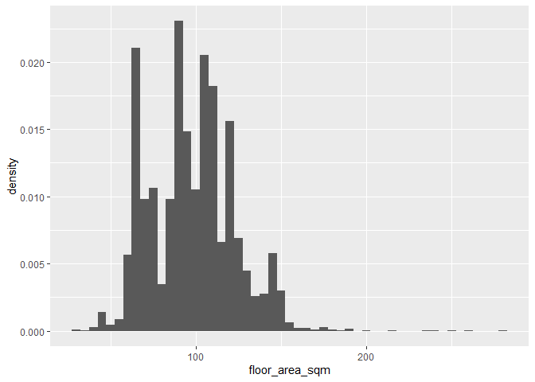<!-- -->

``` r
kurtosis(sales$floor_area_sqm)
```

    ## [1] -0.1450646

``` r
skewness(sales$floor_area_sqm)
```

    ## [1] 0.2770161

### Price

The distribution of resale price is highly skewed. It indicated that
less higher pricing distributed on the plot, which may caused by
government regulation on HDB price control in order to lower the housing
price.

``` r
price_distribution <- draw_dist(sales, "resale_price", 10000)
price_distribution
```

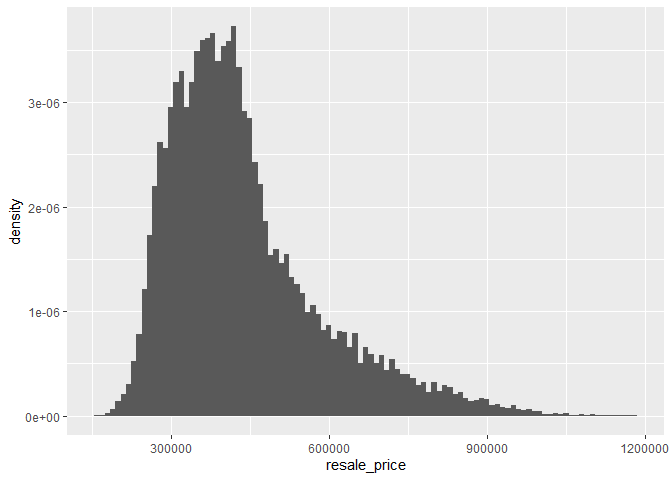<!-- -->

``` r
kurtosis(sales$resale_price)
```

    ## [1] 1.518447

``` r
skewness(sales$resale_price)
```

    ## [1] 1.2216

### remaining lease

The distribution of remaining lease is quit varied, maybe because of
different construction date.

``` r
lease_distribution <- draw_dist(sales, "remaining_lease", 2)
lease_distribution
```

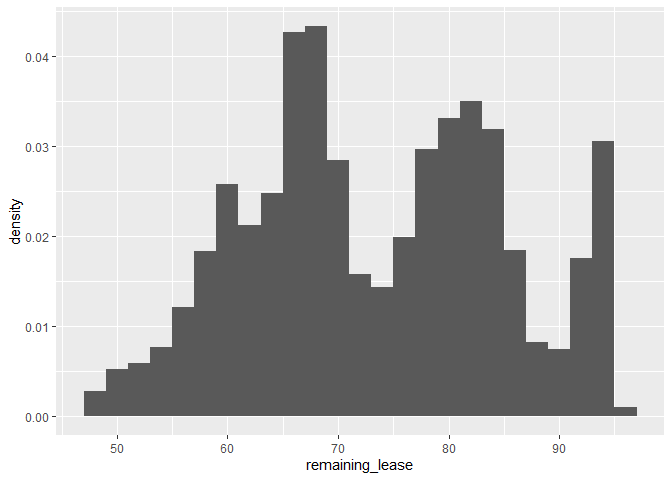<!-- -->

``` r
kurtosis(sales$remaining_lease)
```

    ## [1] -0.8757677

``` r
skewness(sales$remaining_lease)
```

    ## [1] 0.05720332

### month

The distributino of month is much more even, compared to other variable.
It can show the suppy of housing will be will control and restrict.

``` r
sales %>% 
  mutate(m = lubridate::month(month)) %>% 
  group_by(m) %>% 
  ggplot(aes(m)) +
  geom_bar()
```

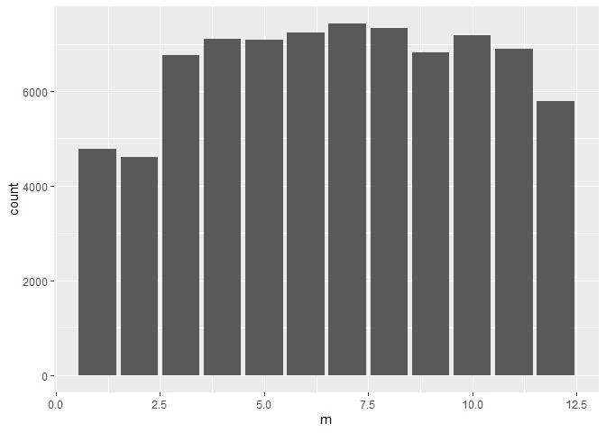<!-- -->

### flat\_type

Most flat type would be 3-room, 4-room and 5-room.

``` r
sales %>% 
  ggplot(aes(flat_type)) +
  geom_bar()
```

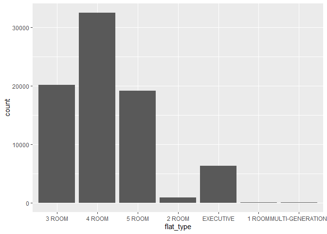<!-- -->

### town

Jurong West, Woodlands and Sengkang will has the largest number of
housing, while Bukit Timah, Marina Parade and Central area has the
least. It may because of the more central Singapore, the land is more
scarce.

``` r
sales %>% 
  ggplot(aes(fct_infreq(town))) +
  geom_bar() +
  coord_flip()
```

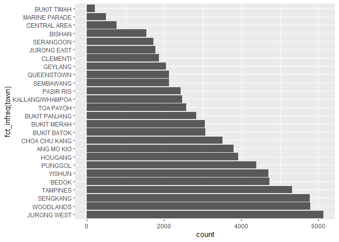<!-- -->

### flat\_model

``` r
sales %>% 
  ggplot(aes(fct_infreq(flat_model))) +
  geom_bar() +
  coord_flip()
```

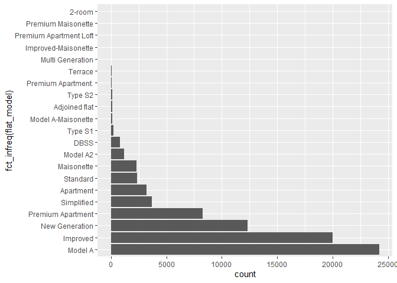<!-- -->

### storey\_range

``` r
sales %>% 
  ggplot(aes(fct_infreq(storey_range))) +
  geom_bar() +
  coord_flip()
```

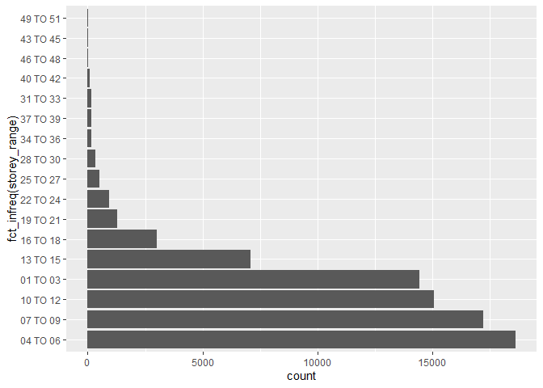<!-- -->

## Question 2

Analyze the distribution of (some of) these variables for different
subsets of the data. For example, explore the difference between towns,
or between flat types.

### difference between towns

``` r
sales %>% 
  ggplot(aes(x = fct_reorder(town, floor_area_sqm), y = floor_area_sqm)) + 
  geom_boxplot() +
  coord_flip()
```

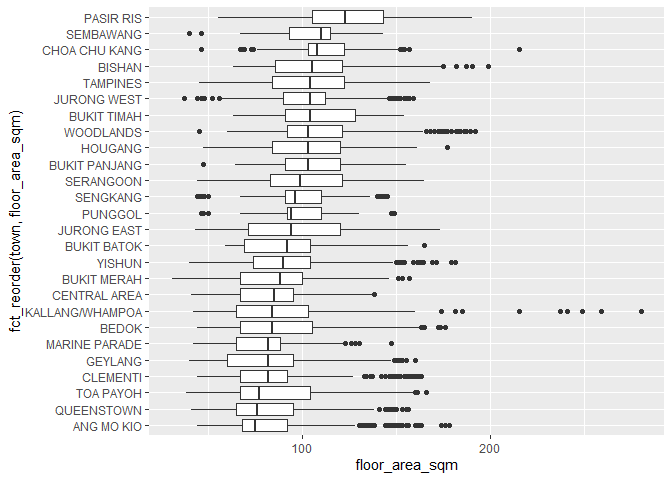<!-- -->

Housing in Pasir Ris, Sembawang, Choa Chu Kang tends to have larger
area. Housing in Kallang may generally small, but few of them are very
large.

``` r
sales %>% 
  ggplot(aes(x = fct_reorder(town, resale_price), y = resale_price)) + 
  geom_boxplot() +
  coord_flip()
```

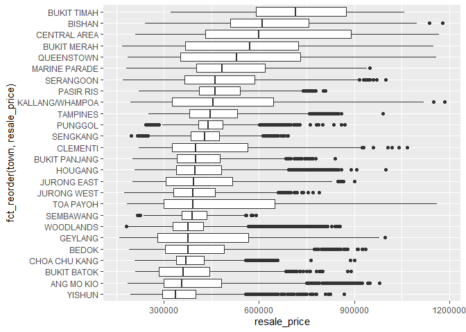<!-- -->

Central area has higher housing pricing. Apart from central districts,
other towns have more even average of housing price.

### difference between flat types

``` r
sales %>% 
  ggplot(aes(x = fct_reorder(storey_range, resale_price), y = resale_price)) +
  geom_boxplot() +
  coord_flip()
```

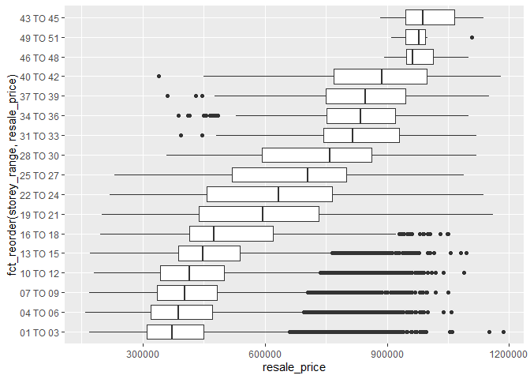<!-- -->

``` r
  # facet_wrap(~ flat_type)
```

Storey and resale price have postive relation, the higher the level, the
more expensive the price. However, there may exist big gaps between 16
to 21, and 40 to 48. Once over 18, the pricing surges a large amount.

## Question 3

Analyze the distribution of at least one variable for unique
combinations of town and flat\_type (for each town, for each flat type:
Ang Mo Kio, 1 room; Ang Mo Kio 2 room; etc.)

``` r
sales %>% 
  group_by(town) %>% 
  skim(resale_price)
```

|                                                  |            |
| :----------------------------------------------- | :--------- |
| Name                                             | Piped data |
| Number of rows                                   | 79100      |
| Number of columns                                | 11         |
| \_\_\_\_\_\_\_\_\_\_\_\_\_\_\_\_\_\_\_\_\_\_\_   |            |
| Column type frequency:                           |            |
| numeric                                          | 1          |
| \_\_\_\_\_\_\_\_\_\_\_\_\_\_\_\_\_\_\_\_\_\_\_\_ |            |
| Group variables                                  | town       |

Data summary

**Variable type: numeric**

| skim\_variable | town            | n\_missing | complete\_rate |     mean |        sd |     p0 |      p25 |    p50 |    p75 |    p100 | hist  |
| :------------- | :-------------- | ---------: | -------------: | -------: | --------: | -----: | -------: | -----: | -----: | ------: | :---- |
| resale\_price  | ANG MO KIO      |          0 |              1 | 416431.0 | 158873.99 | 185000 | 300002.2 | 355000 | 480000 |  980000 | ▇▅▂▁▁ |
| resale\_price  | BEDOK           |          0 |              1 | 412097.6 | 137080.67 | 190000 | 303000.0 | 375000 | 490000 |  935000 | ▇▇▃▂▁ |
| resale\_price  | BISHAN          |          0 |              1 | 630955.3 | 177020.68 | 239000 | 510000.0 | 610000 | 756444 | 1180000 | ▂▇▆▃▁ |
| resale\_price  | BUKIT BATOK     |          0 |              1 | 384389.6 | 120810.66 | 210000 | 283000.0 | 360000 | 443000 |  890000 | ▇▆▂▁▁ |
| resale\_price  | BUKIT MERAH     |          0 |              1 | 555016.8 | 195955.09 | 168000 | 368000.0 | 570000 | 724000 | 1150000 | ▆▆▇▅▁ |
| resale\_price  | BUKIT PANJANG   |          0 |              1 | 420138.4 | 105791.04 | 200000 | 340000.0 | 400000 | 476000 |  840000 | ▃▇▃▁▁ |
| resale\_price  | BUKIT TIMAH     |          0 |              1 | 711795.2 | 188986.76 | 320000 | 591250.0 | 715944 | 875000 | 1058000 | ▅▃▇▇▅ |
| resale\_price  | CENTRAL AREA    |          0 |              1 | 653313.3 | 244789.54 | 210000 | 430000.0 | 600000 | 890000 | 1168000 | ▅▇▂▇▂ |
| resale\_price  | CHOA CHU KANG   |          0 |              1 | 390059.2 |  78115.99 | 208000 | 338000.0 | 370000 | 425000 |  900000 | ▅▇▂▁▁ |
| resale\_price  | CLEMENTI        |          0 |              1 | 459451.4 | 171497.65 | 220000 | 325000.0 | 400000 | 564750 | 1068000 | ▇▅▃▁▁ |
| resale\_price  | GEYLANG         |          0 |              1 | 428974.3 | 180173.43 | 160000 | 280000.0 | 375000 | 566000 |  998000 | ▇▆▃▂▁ |
| resale\_price  | HOUGANG         |          0 |              1 | 426292.7 | 127262.12 | 208000 | 338000.0 | 398000 | 480000 | 1000000 | ▆▇▂▁▁ |
| resale\_price  | JURONG EAST     |          0 |              1 | 424409.3 | 140867.13 | 200000 | 305000.0 | 393000 | 515000 |  900000 | ▇▇▅▂▁ |
| resale\_price  | JURONG WEST     |          0 |              1 | 397135.2 |  95285.98 | 175000 | 330000.0 | 392000 | 460000 |  790000 | ▃▇▆▁▁ |
| resale\_price  | KALLANG/WHAMPOA |          0 |              1 | 494093.4 | 194536.56 | 195000 | 325000.0 | 454888 | 645000 | 1185000 | ▇▅▅▂▁ |
| resale\_price  | MARINE PARADE   |          0 |              1 | 540409.4 | 176761.02 | 180000 | 402000.0 | 483888 | 618000 |  950000 | ▁▇▃▂▂ |
| resale\_price  | PASIR RIS       |          0 |              1 | 483993.6 |  95818.30 | 220000 | 410000.0 | 460000 | 540000 |  808000 | ▁▇▆▂▁ |
| resale\_price  | PUNGGOL         |          0 |              1 | 449492.3 |  68701.38 | 243000 | 408000.0 | 440000 | 485000 |  870000 | ▁▇▂▁▁ |
| resale\_price  | QUEENSTOWN      |          0 |              1 | 549037.4 | 211832.30 | 185000 | 351500.0 | 528444 | 730000 | 1160000 | ▇▅▇▃▁ |
| resale\_price  | SEMBAWANG       |          0 |              1 | 397067.9 |  58446.19 | 215000 | 355000.0 | 388000 | 435000 |  590000 | ▁▆▇▃▁ |
| resale\_price  | SENGKANG        |          0 |              1 | 434891.6 |  70541.64 | 196000 | 385000.0 | 428888 | 475000 |  690000 | ▁▅▇▃▁ |
| resale\_price  | SERANGOON       |          0 |              1 | 484239.8 | 153876.14 | 170000 | 365000.0 | 460000 | 585000 | 1000000 | ▃▇▅▂▁ |
| resale\_price  | TAMPINES        |          0 |              1 | 466150.2 | 118829.93 | 250000 | 380000.0 | 445000 | 530000 |  990000 | ▅▇▂▁▁ |
| resale\_price  | TOA PAYOH       |          0 |              1 | 480215.7 | 217834.09 | 182000 | 300000.0 | 390000 | 650000 | 1160888 | ▇▃▃▂▁ |
| resale\_price  | WOODLANDS       |          0 |              1 | 388467.0 |  96693.06 | 180000 | 328000.0 | 375000 | 423000 |  855000 | ▂▇▂▁▁ |
| resale\_price  | YISHUN          |          0 |              1 | 357607.9 |  89600.31 | 195000 | 295000.0 | 335444 | 400000 |  868000 | ▇▇▂▁▁ |

``` r
sales %>% 
  group_by(flat_type) %>% 
  skim(resale_price)
```

|                                                  |            |
| :----------------------------------------------- | :--------- |
| Name                                             | Piped data |
| Number of rows                                   | 79100      |
| Number of columns                                | 11         |
| \_\_\_\_\_\_\_\_\_\_\_\_\_\_\_\_\_\_\_\_\_\_\_   |            |
| Column type frequency:                           |            |
| numeric                                          | 1          |
| \_\_\_\_\_\_\_\_\_\_\_\_\_\_\_\_\_\_\_\_\_\_\_\_ |            |
| Group variables                                  | flat\_type |

Data summary

**Variable type: numeric**

| skim\_variable | flat\_type       | n\_missing | complete\_rate |     mean |        sd |     p0 |    p25 |    p50 |    p75 |    p100 | hist  |
| :------------- | :--------------- | ---------: | -------------: | -------: | --------: | -----: | -----: | -----: | -----: | ------: | :---- |
| resale\_price  | 3 ROOM           |          0 |              1 | 317711.9 |  66378.23 | 170000 | 278000 | 305000 | 340000 | 1185000 | ▇▁▁▁▁ |
| resale\_price  | 4 ROOM           |          0 |              1 | 434135.6 | 112903.97 | 225000 | 360000 | 405000 | 465000 | 1028000 | ▇▇▂▁▁ |
| resale\_price  | 5 ROOM           |          0 |              1 | 525042.1 | 142968.37 | 300000 | 427000 | 475000 | 580000 | 1180000 | ▇▅▂▁▁ |
| resale\_price  | 2 ROOM           |          0 |              1 | 241357.1 |  32858.17 | 160000 | 220000 | 240000 | 256500 |  456888 | ▂▇▁▁▁ |
| resale\_price  | EXECUTIVE        |          0 |              1 | 626223.7 | 113559.88 | 390000 | 545000 | 605000 | 685000 | 1160000 | ▃▇▂▁▁ |
| resale\_price  | 1 ROOM           |          0 |              1 | 200031.2 |  17486.37 | 168000 | 187250 | 200500 | 210750 |  232000 | ▆▃▇▇▃ |
| resale\_price  | MULTI-GENERATION |          0 |              1 | 785495.3 |  79775.95 | 650000 | 733472 | 779000 | 828500 |  990000 | ▅▇▇▂▁ |

``` r
draw_price_each_town <- function(data, town_name){
  plot <- data %>% 
    filter(town == town_name) %>% 
    ggplot() +
    geom_histogram(aes(resale_price)) +
    facet_wrap(~flat_type)
  return(plot)
}
```

``` r
draw_price_each_town(sales, "ANG MO KIO")
```

    ## `stat_bin()` using `bins = 30`. Pick better value with `binwidth`.

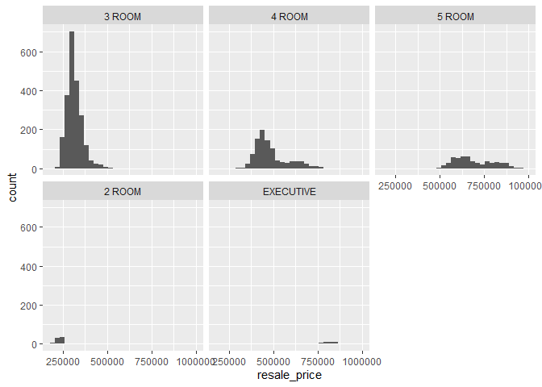<!-- -->

``` r
sales %>% 
  filter(town == "ANG MO KIO") %>% 
  ggplot() +
  geom_histogram(aes(resale_price, fill = flat_type))
```

    ## `stat_bin()` using `bins = 30`. Pick better value with `binwidth`.

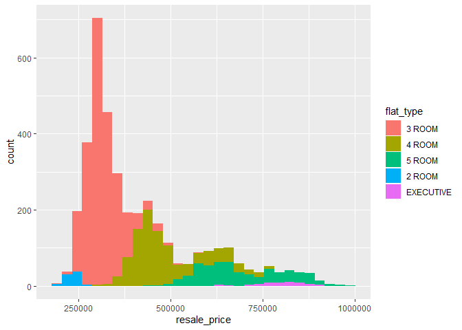<!-- -->

Most of housing in Ang Mo Kio is 3-room type.

``` r
draw_price_each_town(sales, "BISHAN")
```

    ## `stat_bin()` using `bins = 30`. Pick better value with `binwidth`.

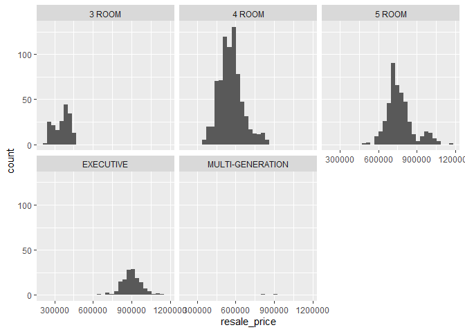<!-- -->

``` r
sales %>% 
  filter(town == "BISHAN") %>% 
  ggplot() +
  geom_histogram(aes(resale_price, fill = flat_type))
```

    ## `stat_bin()` using `bins = 30`. Pick better value with `binwidth`.

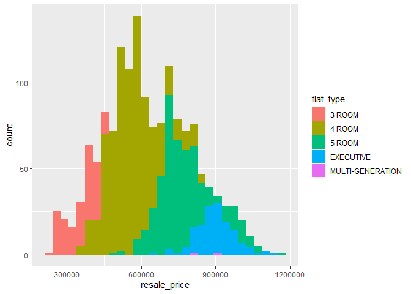<!-- -->

In Bishan, there are more 4-room type of housing are provided.

``` r
draw_price_each_town(sales, "BUKIT TIMAH")
```

    ## `stat_bin()` using `bins = 30`. Pick better value with `binwidth`.

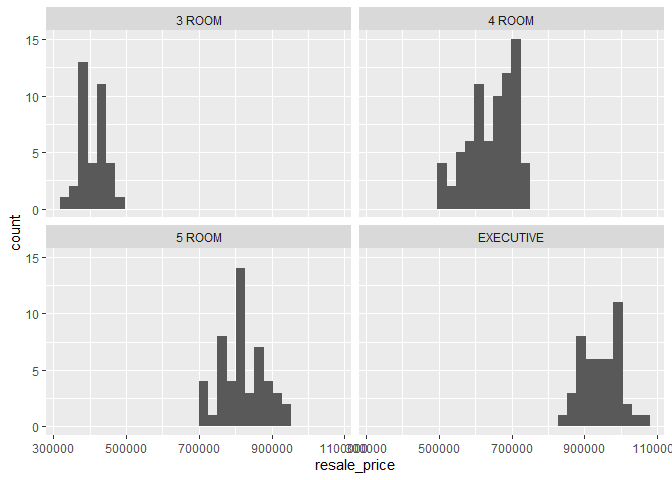<!-- -->

``` r
sales %>% 
  filter(town == "BUKIT TIMAH") %>% 
  ggplot() +
  geom_histogram(aes(resale_price, fill = flat_type))
```

    ## `stat_bin()` using `bins = 30`. Pick better value with `binwidth`.

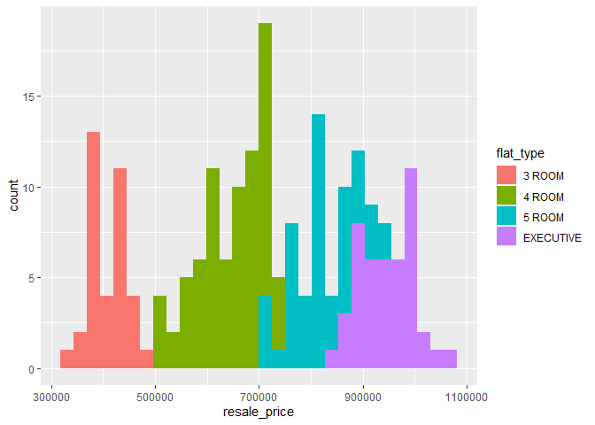<!-- -->

Bukit Timah has more even proportion of different types of housing
ranging from lower price to higher price.

## Question 4

Analyze change in resale price per square meter over time. Use a 6-month
moving average to do so

``` r
library(TTR)
```

``` r
# group by year month
ym_sales <- sales %>% 
  mutate(price_per_sqm = resale_price / floor_area_sqm) %>% 
  mutate(ym = zoo::as.yearmon(month)) %>% 
  group_by(ym) %>% 
  summarise(ym_price_sum = mean(price_per_sqm))
# 
# ym_sales %>% 
#   ggplot(aes(ym, ym_price_sum)) + geom_path()
```

``` r
ym_sales %>% 
  mutate(
    mv_avrg = SMA(ym_sales$ym_price_sum, 6)
  ) %>% 
  ggplot() + geom_path(aes(ym, mv_avrg))
```

    ## Warning: Removed 5 rows containing missing values (geom_path).

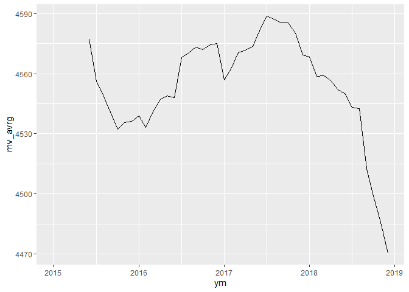<!-- -->

From the moving average, during 2017 to 2018, the price went higher,
then kept falling down.
