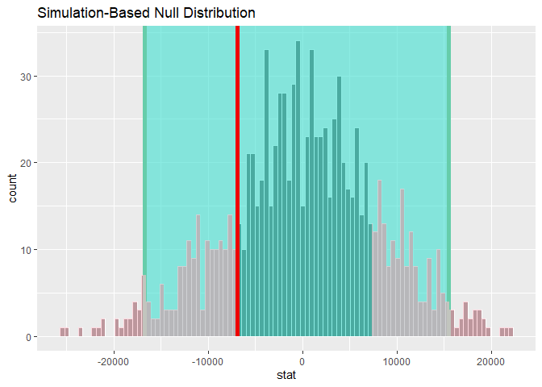
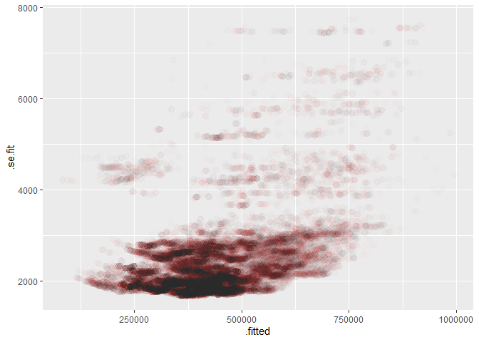

block2
================
Ronnie
2/22/2020

  - [Qustion 1](#qustion-1)
      - [Analysis of 3 room (storeys 04-06 /
        07-09)](#analysis-of-3-room-storeys-04-06-07-09)
      - [Hypothesis Testing: 3 room (storeys 04-06 /
        07-09)](#hypothesis-testing-3-room-storeys-04-06-07-09)
      - [More hypothesis testing](#more-hypothesis-testing)
  - [Question 2](#question-2)
      - [1. Experiment with the addition of different continuous and
        ordinal
        variables](#experiment-with-the-addition-of-different-continuous-and-ordinal-variables)
      - [2. Add the town variable](#add-the-town-variable)
      - [3. Predict for certain needs](#predict-for-certain-needs)
      - [4. predict the 2017 prices](#predict-the-2017-prices)
      - [5. Enhance model](#enhance-model)

## Qustion 1

### Analysis of 3 room (storeys 04-06 / 07-09)

  - **Mean of 3 room (storeys 04-06 / 07-09)**

<!-- end list -->

    ## # A tibble: 2 x 2
    ##   storey_range    stat
    ##   <fct>          <dbl>
    ## 1 07 TO 09     315681.
    ## 2 04 TO 06     308290.

<!-- -->

> The figure shows the difference of 3-room flat between range(4 \~ 6)
> and range(7 \~ 9), and how data distribute.

  - **diff of mean (“04 TO 06”, “07 TO 09”)**

<!-- end list -->

    ## [1] -7391.538

### Hypothesis Testing: 3 room (storeys 04-06 / 07-09)

| Hypothesis | Description                             |
| ---------- | --------------------------------------- |
| H0         | mean(“04 TO 06”) - mean(“07 TO 09”) = 0 |
| H1         | mean(“04 TO 06”) - mean(“07 TO 09”) ≠ 0 |

  - **Distribution of mean diff**

<!-- -->

  - **p-value**

<!-- end list -->

    ## # A tibble: 1 x 1
    ##   p_value
    ##     <dbl>
    ## 1       0

> **Analysis** : The significance is set to 0.05. In this case, the
> p-value is 0 and smaller than 0.05. So, it rejects `H0`, and indicates
> that the average price of 3 room flats on storey 04-06 is
> significantly different from 3 room flats on storey 07-09.

### More hypothesis testing

  - **Comparing 01 TO 03 and 04 TO 06**

<!-- end list -->

    ## mean_obs:  -5030.988 
    ## p_value:  0.002

  - **Comparing 04 TO 06 and 07 TO 09**

<!-- end list -->

    ## mean_obs:  -7391.538 
    ## p_value:  0

  - **Comparing 07 TO 09 and 10 TO 12**

<!-- end list -->

    ## mean_obs:  -6381.678 
    ## p_value:  0

  - **Comparing 10 TO 12 and 13 TO 15**

<!-- end list -->

    ## mean_obs:  -20056.28 
    ## p_value:  0

  - **Comparing 13 TO 15 and 16 TO 18**

<!-- end list -->

    ## mean_obs:  -42552.7 
    ## p_value:  0

  - **Comparing 16 TO 18 and 19 TO 21**

<!-- end list -->

    ## mean_obs:  -6921.859 
    ## p_value:  0.428 
    ## The average price of 3 room flats on storey  16 TO 18  is not significantly different from 3 room flats on storey  19 TO 21

    ## mean_obs:  -6921.859

    ## Warning: F usually corresponds to right-tailed tests. Proceed with caution.

<!-- -->

  - **Comparing 19 TO 21 and 22 TO 24**

<!-- end list -->

    ## mean_obs:  -47743.59 
    ## p_value:  0

  - **Comparing 22 TO 24 and 25 TO 27**

<!-- end list -->

    ## mean_obs:  -41247.59 
    ## p_value:  0.036

  - **Comparing 25 TO 27 and 28 TO 30**

<!-- end list -->

    ## mean_obs:  -52694.43 
    ## p_value:  0.004

  - **Comparing 28 TO 30 and 31 TO 33**

<!-- end list -->

    ## mean_obs:  -30095.59 
    ## p_value:  0.076 
    ## The average price of 3 room flats on storey  28 TO 30  is not significantly different from 3 room flats on storey  31 TO 33

    ## mean_obs:  -30095.59

<!-- -->

  - **Comparing 31 TO 33 and 34 TO 36**

<!-- end list -->

    ## mean_obs:  13541.67 
    ## p_value:  0.546 
    ## The average price of 3 room flats on storey  31 TO 33  is not significantly different from 3 room flats on storey  34 TO 36

    ## mean_obs:  13541.67

<!-- -->

  - **Comparing 34 TO 36 and 37 TO 39**

<!-- end list -->

    ## mean_obs:  -14700 
    ## p_value:  0.592 
    ## The average price of 3 room flats on storey  34 TO 36  is not significantly different from 3 room flats on storey  37 TO 39

    ## mean_obs:  -14700

<!-- -->

  - **Comparing 37 TO 39 and 40 TO 42**

<!-- end list -->

    ## mean_obs:  39533.33 
    ## p_value:  0.324 
    ## The average price of 3 room flats on storey  37 TO 39  is not significantly different from 3 room flats on storey  40 TO 42

    ## mean_obs:  39533.33

<!-- -->

> **Analysis**: From 20 levels, the differenct of price is becoming
> small, as such the p-value is growing larger in successive groups.

## Question 2

### 1\. Experiment with the addition of different continuous and ordinal variables

``` r
sales_2016 <- sales_2016 %>% 
  mutate(storey_range = fct_relevel(storey_range, 
                                    storey_range %>% levels() %>% sort()))
ols <- lm(resale_price ~ storey_range + flat_type + floor_area_sqm + remaining_lease, sales_2016)
```

``` r
glance(ols)
```

    ## # A tibble: 1 x 11
    ##   r.squared adj.r.squared  sigma statistic p.value    df  logLik    AIC    BIC
    ##       <dbl>         <dbl>  <dbl>     <dbl>   <dbl> <int>   <dbl>  <dbl>  <dbl>
    ## 1     0.583         0.582 89735.     1125.       0    25 -2.48e5 4.97e5 4.97e5
    ## # ... with 2 more variables: deviance <dbl>, df.residual <int>

``` r
sales_ols <- augment(ols, data = sales_2016)

sales_ols %>% 
  ggplot(aes(x = .resid)) +
  geom_histogram(aes(y = ..density..), bins = 100) +
  stat_function(fun = dnorm, args = list(mean = mean(sales_ols$.resid), 
                                         sd = sd(sales_ols$.resid)),
                color = "#E69F00", size = 1) +
  geom_vline(xintercept = mean(sales_ols$.resid), color="red")
```

<!-- -->

    ## Skewness:  1.403406 
    ##  Kutosis:  3.078185

> **Analysis**: The model is highly skewed at 1.4. It may indicate that
> most data are underestimated.

### 2\. Add the town variable

``` r
sales_2016 <- sales_2016 %>% 
  mutate(town = as.factor(town))

ols <- lm(resale_price ~ storey_range + town + flat_type + floor_area_sqm + remaining_lease, sales_2016)
```

``` r
glance(ols)
```

    ## # A tibble: 1 x 11
    ##   r.squared adj.r.squared  sigma statistic p.value    df  logLik    AIC    BIC
    ##       <dbl>         <dbl>  <dbl>     <dbl>   <dbl> <int>   <dbl>  <dbl>  <dbl>
    ## 1     0.848         0.847 54265.     2192.       0    50 -2.39e5 4.77e5 4.78e5
    ## # ... with 2 more variables: deviance <dbl>, df.residual <int>

``` r
sales_ols <- augment(ols, data = sales_2016)
```

``` r
sales_ols %>% 
  ggplot(aes(x = .resid)) +
  geom_histogram(aes(y = ..density..), bins = 100) +
  stat_function(fun = dnorm, args = list(mean = mean(sales_ols$.resid), 
                                         sd = sd(sales_ols$.resid)),
                color = "#E69F00", size = 1) +
  geom_vline(xintercept = mean(sales_ols$.resid), color="red")
```

<!-- -->

    ## Skewness:  0.6297028 
    ##  Kutosis:  2.542945

> **Analysis**: Although the distributino curve still skewed, but the
> model improves a lot, comparing to the one without considering town
> variable.

### 3\. Predict for certain needs

Based on your model, try to work through a simple example. Let’s say you
have a family in the market for a `3 room flat` in Punggol. They are
looking for a flat sized at `67 sq meters` and `95 years` left on the
lease. What should they be looking to pay according to your model? Can
you explain to them how each of their choices translates into the flat
price? Compare your estimate with all known transactions of flats with
those characteristics - how correct was your model?

  - **Predict**

<!-- end list -->

    ## Warning: Calling `as_tibble()` on a vector is discouraged, because the behavior is likely to change in the future. Use `tibble::enframe(name = NULL)` instead.
    ## This warning is displayed once per session.

    ## # A tibble: 17 x 3
    ##    value    .fitted .se.fit
    ##    <chr>      <dbl>   <dbl>
    ##  1 01 TO 03 300237.   2353.
    ##  2 04 TO 06 315593.   2286.
    ##  3 07 TO 09 326796.   2293.
    ##  4 10 TO 12 335127.   2304.
    ##  5 13 TO 15 345277.   2442.
    ##  6 16 TO 18 371484.   2893.
    ##  7 19 TO 21 405233.   4047.
    ##  8 22 TO 24 427188.   4606.
    ##  9 25 TO 27 431815.   5869.
    ## 10 28 TO 30 458651.   6606.
    ## 11 31 TO 33 501186.   9684.
    ## 12 34 TO 36 507851.   9297.
    ## 13 37 TO 39 465202.  10398.
    ## 14 40 TO 42 512638.  14745.
    ## 15 43 TO 45 684002.  54478.
    ## 16 46 TO 48 611703.  31680.
    ## 17 49 TO 51 557388.  54468.

> **Analysis**: the table shows the prediction of 3-room type changes by
> the storey range.

``` r
real_data <- sales %>%
  filter(town == "PUNGGOL", flat_type == "3 ROOM", floor_area_sqm == 67, remaining_lease == 95)
```

``` r
ggplot() +
  geom_point(data = real_data,
             mapping = aes(x = storey_range, y = resale_price),
             size = 3,
             alpha = .4) +
  geom_point(data = predict,
             mapping = aes(x = value, y = .fitted), color = "red", 
             size = 3, 
             alpha = .4) +
  coord_flip()
```

<!-- -->

> **Analysis**: Comparing to the real data, the prediction is close to
> the reality, but all undershoot, except missing data at higher
> storeys.

### 4\. predict the 2017 prices

``` r
sales_2017 <- sales %>%
  filter(month > "2016-12-01" & month < "2018-01-01")
predict_2017 <- augment(ols, newdata = sales_2017)
predict_2016 <- augment(ols, newdata = sales_2016)
```

<!-- -->

<!-- -->

    ## Mean(2016 prediction):  2442.589 
    ##  Mean(2017 prediction):  2512.875

> **Analysis**: Comparing to data of 2016, the error of the data of 2017
> goes higher.

### 5\. Enhance model

``` r
ols <- lm(resale_price ~ storey_range + town * (floor_area_sqm^2) * flat_type * remaining_lease, sales_2016)
glance(ols)
```

    ## # A tibble: 1 x 11
    ##   r.squared adj.r.squared  sigma statistic p.value    df  logLik    AIC    BIC
    ##       <dbl>         <dbl>  <dbl>     <dbl>   <dbl> <int>   <dbl>  <dbl>  <dbl>
    ## 1     0.918         0.916 40205.      453.       0   469 -2.33e5 4.66e5 4.70e5
    ## # ... with 2 more variables: deviance <dbl>, df.residual <int>

<!-- -->

> **Analysis:** The related formula `storey_range + town *
> (floor_area_sqm^2) * flat_type * remaining_lease` also cost longer
> time to compute. By multiplying different possibly significant
> variable, the model has R^2 at 0.918, which has much improved about 8%
> than the linear model (0.848).
