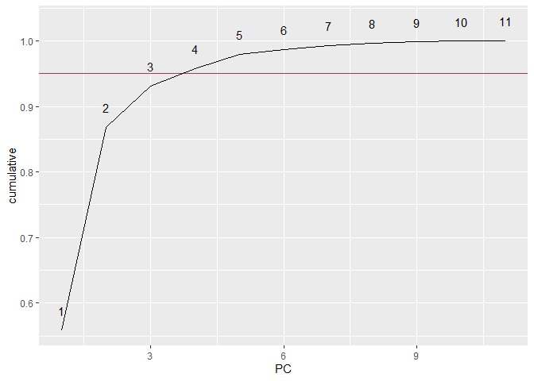

assignment-3
================
Ronnie
3/26/2020

  - [1. Variable section](#variable-section)
  - [2. Perform PCA and extract
    components](#perform-pca-and-extract-components)
  - [3. Components to keep](#components-to-keep)
  - [4. Directions plot](#directions-plot)
  - [5. Loadings plot](#loadings-plot)
  - [6. `PCA` vs. `MDS`](#pca-vs.-mds)
  - [7. Conclusion](#conclusion)
  - [8.Bonus](#bonus)
      - [UMAP](#umap)
      - [`UMAP` vs `MDS`](#umap-vs-mds)
      - [`UMAP` vs `PCA`](#umap-vs-pca)

## 1\. Variable section

The data selection will be related to income, education, occupation,
dwelling and status.

``` r
pln_select <- planning_areas %>% 
  column_to_rownames(var = "planning_area") %>% 
  select(starts_with("hh"),
         starts_with("edu"),
         starts_with("occupation"),
         starts_with("dwelling"),
         starts_with("status"))
pln_select %>% colnames()
```

    ##  [1] "hh_income_lt_2000"                     
    ##  [2] "hh_income_gt_17500"                    
    ##  [3] "hh_1person"                            
    ##  [4] "hh_5person_plus"                       
    ##  [5] "edu_no_qual_primary"                   
    ##  [6] "edu_university"                        
    ##  [7] "occupation_senior_manager_professional"
    ##  [8] "occupation_cleaners_labourers_plant"   
    ##  [9] "dwelling_1_2_room"                     
    ## [10] "dwelling_condo_landed"                 
    ## [11] "status_unemployed"

## 2\. Perform PCA and extract components

``` r
pc <- prcomp(pln_select, center=T, scale = T)
```

## 3\. Components to keep

``` r
tidy(pc, "pcs") %>% 
  ggplot(aes(x = PC, y = cumulative)) +
  geom_hline(yintercept = 0.95, color = "maroon") +
  geom_line() +
  geom_text(aes(x = PC, y = cumulative, label = PC), nudge_y = 0.03)
```

<!-- -->

**Discussion**: The selction of number for principal component will be
based on how much variance will be retained so that the loss in
dimension reduction can be minimized. From the diagram, x axis is the
number of PC, y axis is the cuulative variance. In some extent, the
first two components can already retain the majority of variance. In
order to retain 95% of variance in dimention reduction, the first four
principal components will be kept.

## 4\. Directions plot

``` r
tidy(pc, "variables") %>% 
  filter(PC < 5) %>% 
  ggplot(aes(x = column, y = value)) + 
  geom_hline(yintercept = 0) + 
  geom_col(aes(fill=(value >= 0)),
           show.legend = FALSE) +
  coord_flip() +
  facet_grid(~PC)
```

<!-- -->

**Discussion**:

## 5\. Loadings plot

``` r
autoplot(pc, label = TRUE, x = 1, y = 2, label.size=2, loadings = T, loadings.label = T)
```

<!-- -->

**Discussion**: Some towns, like Bukit Batok, Hougang, Punggol,
Tampines, Cho Chu Kang, Pasir Ris and Sengkang, are closer to each other
with dominated by PC2. Even the variables of status unemployed and
hh\_5person\_plus shows less likely have relation (the vector angle is
almost 90 degrees), these towns may be affected by these factors
respectively. Apart from this cluster, Bukit Merah, Outram, Toa Payoh,
Kallang are have more similarity in characteristics due to their
proximity on the PC1-PC2 dimension space which unveils the relations by
dwelling type, income (2000) and household (1 person).

``` r
autoplot(pc, label = TRUE, x = 3, y = 4, label.size=2,loadings = T, loadings.label = T) 
```

<!-- -->

**Discussion**: Although it shows certain similarity between Tanglin and
Bukit Timah due to a higher income, education and job position from
previous chart, they still have some nuances in-between which causes
contrary directions on the PC3-PC4 plan.

``` r
pc$x[c('BUKIT TIMAH', 'TANGLIN'), 1:4]
```

    ##                  PC1       PC2       PC3       PC4
    ## BUKIT TIMAH 6.736305 0.3557813  1.286519 0.3959560
    ## TANGLIN     7.883115 2.6665670 -1.394441 0.4906749

## 6\. `PCA` vs. `MDS`

``` r
pln_select_matrix <- pln_select %>% 
  distances::distances(., normalize = "studentize") %>% 
  as.matrix()

mds_pln_select <- cmdscale(pln_select_matrix) %>% 
  as_tibble() %>% 
  rename(MDS_Y1 = V1, MDS_Y2 = V2)

mds_planning_area <- planning_areas %>%
  select(planning_area) %>%
  bind_cols(., mds_pln_select)

mds_plot <- ggplot(mds_planning_area, aes(x = MDS_Y1, y = MDS_Y2)) +
  geom_text(aes(label = planning_area), size=2) +
  geom_point(color='black')

mds_plot
```

<!-- -->

MDS is non-metric analysis but based on approximate distance. However,
PCA reduces dimention via catching the variance based on finidng minimum
project errror into original dimension, which provides us more in-depth
in how variables converge and provide informative relation. For example,
from the dataset and PCA, it indicates that the clusters were generated
by certain dominant factors, such as income, household and occupations.
Later, it delivers more nuances through additinoal principal components,
as such Tanglin and Bukit Timah can have subtle difference which can be
examined from PC3 and PC4, even though both towns attract meritocrats
and upper middle-class.

## 7\. Conclusion

The socio-economic landascape of Singapore tends to be similar and forms
into a bulk cluster except Tanglin and Bukit Timah have a vast
distinction compared to others. There are certain similarity but also
some nuance by which it can tell the variety of towns. It generally
distributed and dispersed ranging from central area to the north and
west.

It can be seen that a group formed with senior manager occupation and
higher income which clusters some towns are Marine Parade, Novena,
Tanglin and Bukit Timah, even though there are still a distinction
in-between. Apart from that, income at 2000 and dwelling 1 and 2 room
also illustrate another group which consists of Kallang, Toa Payoh,
Geylang, Bukit Merah. Last but no least, higher income and education
have intensively negative relation to labourers, cleaners and
unemployment. It also forms a seggregation on residential areas
depending on this different demographics and socioeconomic status.

Although most towns form a conhesive cluster, but some towns have its
own characteristics and migrates from cluster in other dimension view of
datasets (PC3 / PC4), as such Sengkang tends to have dwelling 1 or 2
room, but Bukit Batok has higher leaning on umployment status, with
Pasir Ris is potentially under impact from both factors.

Additionally, some variables may have more insight provision to imply
difference, such as the remaining lease, ethnicity and genders.

## 8.Bonus

``` r
library(smallvis)
```

### UMAP

``` r
pln_umap <- smallvis(pln_select_matrix, method = "umap", perplexity = 25, eta = 0.01)
```

<!-- --><!-- --><!-- --><!-- --><!-- --><!-- --><!-- -->

``` r
pln_umap_tibble <- pln_umap %>% 
  as.tibble()

umap_plot <- planning_areas %>% 
  select(planning_area) %>% 
  bind_cols(pln_umap_tibble) %>% 
  rename(UMAP_Y1 = V1, UMAP_Y2 = V2) %>% 
  ggplot(aes(UMAP_Y1, -UMAP_Y2)) +
  geom_text(aes(label=planning_area), size=2) +
  geom_point(color='black') 
```

``` r
pca_plot <- autoplot(pc, label = TRUE, x = 1, y = 2, label.size=2)
```

### `UMAP` vs `MDS`

``` r
(umap_plot + mds_plot)
```

<!-- -->

**Discussion**: From MDS(right), it already can tell some potential
difference between two clusters: one (cluster A) consists of Ang Mo Kio,
Geylang, Toa Payoh, etc.; another one (cluster B) consists of Tampines,
Choa Chu Kang, etc. However, the similarity of cluster A is emphasized
by UMAP with cluster B is more dispersed.

### `UMAP` vs `PCA`

``` r
(umap_plot + pca_plot)
```

<!-- -->

**Discussion**: UMAP and PCA have similar performance in clustering
towns. However, UMAP contains more information of variety instead PCA
providng more proximity and overlapping of towns.Also, the tanglin and
Bukit Timah has more similarity which is amplified in UMAP.
