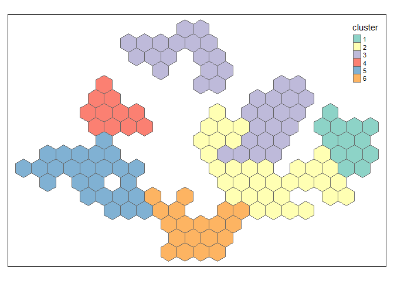

assignment-3
================
Ronnie
4/9/2020

  - [Load data](#load-data)
  - [Average floor area](#average-floor-area)
  - [Average price per square meter](#average-price-per-square-meter)

## Load data

``` r
resale <- readRDS(here::here("data/resale_with_geom.rds"))
set.seed(13)
resale_sample <- sample_n(resale, 5000)

planning_areas <- st_read(here::here("data/MP14_shp/MP14_PLNG_AREA_NO_SEA_PL.shp")) %>%
  filter(!(OBJECTID == 49 | OBJECTID == 18))
```

    ## Reading layer `MP14_PLNG_AREA_NO_SEA_PL' from data source `D:\Workspace\SUTD-2.522-urban-analysis\01-project\liu-nuozhi\data\MP14_shp\MP14_PLNG_AREA_NO_SEA_PL.shp' using driver `ESRI Shapefile'
    ## Simple feature collection with 55 features and 12 fields
    ## geometry type:  MULTIPOLYGON
    ## dimension:      XY
    ## bbox:           xmin: 2667.538 ymin: 15748.72 xmax: 56396.44 ymax: 50256.33
    ## epsg (SRID):    NA
    ## proj4string:    +proj=tmerc +lat_0=1.366666666666667 +lon_0=103.8333333333333 +k=1 +x_0=28001.642 +y_0=38744.572 +datum=WGS84 +units=m +no_defs

``` r
hex_grid <- planning_areas %>%
  st_make_grid(st_bbox(.), square = FALSE, cellsize = 1500) %>%
  st_sf() %>%
  mutate(hex_id = row_number())

resale_hex <- st_join(resale_sample, hex_grid) %>%
  st_set_geometry(NULL)
```

## Average floor area

``` r
hex_grid <- planning_areas %>%
  st_make_grid(st_bbox(.), square = FALSE, cellsize = 1500) %>% 
  st_sf() %>% 
  mutate(hex_id = row_number())

resale_hex <- st_join(resale_sample, hex_grid) %>% 
  st_set_geometry(NULL)

floor_area_sqm <- resale_hex %>% 
  group_by(hex_id) %>% 
  summarise(average_area = mean(floor_area_sqm)) %>% 
  left_join(hex_grid, .) %>% 
  #replace_na(list(floor_area_sqm = 999))
  filter(average_area > 0)
```

    ## Joining, by = "hex_id"

``` r
hex_sp <- as(floor_area_sqm, 'Spatial')
hex_neighbors <- readRDS(here::here("data/hex_neighbors_connect_floor_area_sqm.rds"))
plot(hex_neighbors, coordinates(hex_sp))
```

<!-- -->

``` r
cluster_data <- floor_area_sqm %>% 
  st_set_geometry(NULL) %>%
  select(average_area)

hex_edge_costs <- nbcosts(hex_neighbors, cluster_data)
hex_edge_weights <- nb2listw(hex_neighbors, hex_edge_costs, style="B")
hex_mstree <- mstree(hex_edge_weights)
```

``` r
hex_skater_k6 <- skater(hex_mstree[,1:2], 
                        cluster_data, 
                        ncuts = 5,
                        crit = 10)

floor_area_sqm$cluster <- as.character(hex_skater_k6$groups)
plot_k6 <- tm_shape(floor_area_sqm) + tm_polygons(col = "cluster")
plot_k6
```

<!-- -->

``` r
floor_area_sqm %>% group_by(cluster) %>% 
  summarise(cluster_mean_area = round(mean(average_area), 2)) %>% 
  ggplot(aes(fct_reorder(cluster, cluster_mean_area), 
             cluster_mean_area)) + 
  geom_histogram(fill="#AED6F1", stat = "identity")+
  geom_text(aes(label=cluster_mean_area), size=3) +
  coord_flip()
```

<!-- -->

**Discussion:** There average floor area have less difference between
each other ranging from 80 sqm to 115 sqm. No surprisingly, Central
Singapore (cluster 6) has least areas for housing because of land
scarcity. The flat type, as such around 80 sqm in average, only enable
to provide limit spaces which meet basic living functions. However, in
northeast Singapore (Cluster 1), near Changi, Tampines and Pasir Ris, it
has the largest areas in average, with North Singapore near Sembangwang,
Yishun (Cluster 2) ranks the second in proximaty to the Northeast.

``` r
hex_skater_k10 <- skater(hex_mstree[,1:2], 
                        cluster_data, 
                        ncuts = 9,
                        crit = 10)

floor_area_sqm$cluster <- as.character(hex_skater_k10$groups)
plot_k10 <- tm_shape(floor_area_sqm) + tm_polygons(col = "cluster")


hex_skater_k8 <- skater(hex_mstree[,1:2], 
                        cluster_data, 
                        ncuts = 7,
                        crit = 10)

floor_area_sqm$cluster <- as.character(hex_skater_k8$groups)
plot_k8 <- tm_shape(floor_area_sqm) + tm_polygons(col = "cluster")

hex_skater_k12 <- skater(hex_mstree[,1:2], 
                        cluster_data, 
                        ncuts = 11,
                        crit = 10)

floor_area_sqm$cluster <- as.character(hex_skater_k12$groups)
plot_k12 <- tm_shape(floor_area_sqm) + tm_polygons(col = "cluster")


tmap_arrange(plot_k6, plot_k8, plot_k10, plot_k12)
```

<!-- -->

**Discussion: ** With less clusters, the central area will be more
homogeneous. Also, the places near woodlands and Yishun were combined
into one cluster in top-left chart. However, as the number of cluster
increasing, the regions can differentiate from each other.

## Average price per square meter

``` r
hex_grid <- planning_areas %>%
  st_make_grid(st_bbox(.), square = FALSE, cellsize = 1500) %>% 
  st_sf() %>% 
  mutate(hex_id = row_number())

resale_hex <- st_join(resale_sample, hex_grid) %>% 
  st_set_geometry(NULL)

price_per_sqm <- resale_hex %>% 
  mutate(price_per_sqm = resale_price / floor_area_sqm) %>% 
  group_by(hex_id) %>% 
  summarise(price_per_sqm = mean(price_per_sqm)) %>% 
  left_join(hex_grid, .) %>% 
  #replace_na(list(floor_area_sqm = 999))
  filter(price_per_sqm > 0)
```

    ## Joining, by = "hex_id"

``` r
hex_sp <- as(price_per_sqm, 'Spatial')
hex_neighbors <- readRDS(here::here("data/hex_neighbors_connect_price_per_sqm.rds"))
plot(hex_neighbors, coordinates(hex_sp))
```

<!-- -->

``` r
cluster_data <- price_per_sqm %>% 
  st_set_geometry(NULL) %>%
  select(price_per_sqm)

hex_edge_costs <- nbcosts(hex_neighbors, cluster_data)
hex_edge_weights <- nb2listw(hex_neighbors, hex_edge_costs, style="B")
hex_mstree <- mstree(hex_edge_weights)
```

``` r
hex_skater_k6 <- skater(hex_mstree[,1:2], 
                        cluster_data, 
                        ncuts = 5,
                        crit = 10)

price_per_sqm$cluster <- as.character(hex_skater_k6$groups)
plot_k6 <- tm_shape(price_per_sqm) + tm_polygons(col = "cluster")
plot_k6
```

<!-- -->

``` r
price_per_sqm %>% group_by(cluster) %>% 
  summarise(cluster_mean_price = round(mean(price_per_sqm), 2)) %>% 
  ggplot(aes(fct_reorder(cluster, cluster_mean_price), 
             cluster_mean_price)) + 
  geom_histogram(fill="#AED6F1", stat = "identity")+
  geom_text(aes(label=cluster_mean_price), size=3) +
  coord_flip()
```

<!-- -->

**Discussion:** Unsurprisingly, central Singapore (cluster 2) is the
most expensive and has huge different with other parts of Singapore at
around 6000 per sqm. Apart from central Singapore, the prices shows less
difference in a range between 3500 and 4800. The regions closer to each
other show more similarity in prices. East Singapore (cluster 6) and
northeast Singapore (cluster 4) take third and second places
respectively. However, west(cluster 3) and northwest (cluster 1 & 5)
parts illustrate a lower price, comparing to east regions, especially
the place near Chua Chu Kang (cluster 5) has lowest price at around 3673
per sqm in average.

``` r
hex_skater_k10 <- skater(hex_mstree[,1:2], 
                        cluster_data, 
                        ncuts = 9,
                        )

price_per_sqm$cluster <- as.character(hex_skater_k10$groups)
plot_k10 <- tm_shape(price_per_sqm) + tm_polygons(col = "cluster")


hex_skater_k8 <- skater(hex_mstree[,1:2], 
                        cluster_data, 
                        ncuts = 7,
                        )

price_per_sqm$cluster <- as.character(hex_skater_k8$groups)
plot_k8 <- tm_shape(price_per_sqm) + tm_polygons(col = "cluster")

hex_skater_k12 <- skater(hex_mstree[,1:2], 
                        cluster_data, 
                        ncuts = 11,
                        )

price_per_sqm$cluster <- as.character(hex_skater_k12$groups)
plot_k12 <- tm_shape(price_per_sqm) + tm_polygons(col = "cluster")


tmap_arrange(plot_k6, plot_k8, plot_k10, plot_k12)
```

<!-- -->

**Discussion:** If it creates 6 clusters, the central area will be more
homogeneous. Once the number of cluster increasing to 8, the regions
differentiate from one single cluster and split into three parts:
cluster 2, 7 an 8 in top-right chart with 8 clusters. However, with the
number of clusters increasing to 10 and 12, there wound be less
differentiation.
