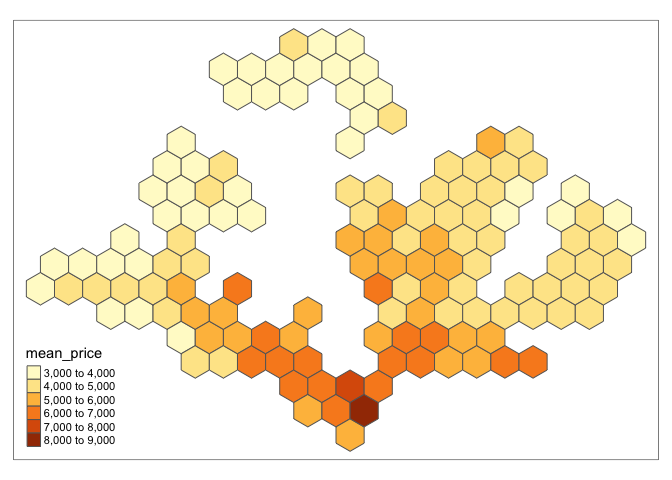
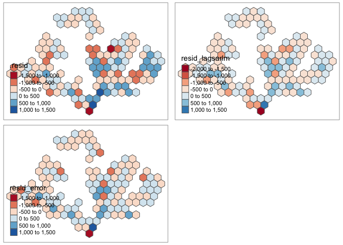

assignment5
================
Ronnie
4/22/2020

``` r
library(tidyverse)
library(sf)
library(tmap)
library(broom)
library(spdep)
```

``` r
planning_areas_sf <- st_read(here::here("data/MP14_shp/MP14_PLNG_AREA_NO_SEA_PL.shp")) %>%
  filter(!(OBJECTID == 49 | OBJECTID == 18)) # remove islands
```

    ## Reading layer `MP14_PLNG_AREA_NO_SEA_PL' from data source `/Users/yaya/Desktop/Liu/liu-nuozhi/data/MP14_shp/MP14_PLNG_AREA_NO_SEA_PL.shp' using driver `ESRI Shapefile'
    ## Simple feature collection with 55 features and 12 fields
    ## geometry type:  MULTIPOLYGON
    ## dimension:      XY
    ## bbox:           xmin: 2667.538 ymin: 15748.72 xmax: 56396.44 ymax: 50256.33
    ## proj4string:    +proj=tmerc +lat_0=1.366666666666667 +lon_0=103.8333333333333 +k=1 +x_0=28001.642 +y_0=38744.572 +datum=WGS84 +units=m +no_defs

``` r
planning_areas <- read_csv(here::here("data/planning_areas.csv")) %>%
  left_join(planning_areas_sf, ., by = c("PLN_AREA_N" = "planning_area")) %>%
  filter(area_hdb > 0) %>%
  st_buffer(0) # we use this to correct shapefile issues

hex_grid <- planning_areas %>%
  st_make_grid(st_bbox(.), square = FALSE, cellsize = 1500) %>%
  st_sf() %>%
  mutate(hex_id = row_number())

hex_grid <- st_join(hex_grid, planning_areas, largest = T)


resale <- readRDS(here::here("data/resale_with_geom.rds"))
resale_hex <- st_join(resale, hex_grid) %>%
  st_set_geometry(NULL)

hex_grid <- resale_hex %>%
  mutate(price_sqm = resale_price / floor_area_sqm) %>%
  group_by(hex_id) %>%
  summarise(
    mean_price = mean(price_sqm),
    mean_lease = mean(remaining_lease),
    mean_floor_area = mean(floor_area_sqm)
  ) %>%
  left_join(hex_grid, .) %>%
  filter(mean_price > 0)

tm_shape(hex_grid) + tm_polygons(col = "mean_price")
```

<!-- -->

## Model

``` r
####### ols
price_ols <- lm(mean_price ~ hh_income_lt_2000 + edu_university + mean_lease, data = hex_grid)

hex_ols <- augment(price_ols, data = hex_grid) %>%st_as_sf()
map_ols <- tm_shape(hex_ols) + tm_polygons(col = ".resid", palette = "RdBu")

hex_sp <- as(hex_ols, "Spatial")
hex_neighbors <- poly2nb(hex_sp)
hex_weights <- nb2listw(hex_neighbors, style = "W", zero.policy = TRUE)
hex_ols$.resid_lag <- lag.listw(hex_weights, hex_ols$.resid)
# ggplot(hex_ols, aes(.resid, .resid_lag)) + geom_point() + geom_smooth()

####### lag
price_lag <- lagsarlm(mean_price ~ hh_income_lt_2000 + edu_university + mean_lease,
  data = hex_grid,
  listw = hex_weights
)
hex_grid$resid_lagsarlm <- residuals(price_lag)
map_lag <- tm_shape(hex_grid) + tm_polygons(col = "resid_lagsarlm", palette = "RdBu")

####### err
price_error <- errorsarlm(mean_price ~ hh_income_lt_2000 + edu_university + mean_lease,
  data = hex_grid, listw = hex_weights
)
hex_grid$resid_error <- residuals(price_error)
map_error <- tm_shape(hex_grid) + tm_polygons(col = "resid_error", palette = "RdBu")

tmap_arrange(map_ols, map_lag, map_error)
```

<!-- -->

## Analysis

``` r
y_bar <- mean(hex_grid$mean_price)
SS_tot <- sum((hex_grid$mean_price - y_bar)^2)
SS_reslag <- sum(hex_grid$resid_lagsarlm^2)
SS_reserror <- sum(hex_grid$resid_error^2)
Rsqr_lag <- 1 - (SS_reslag / SS_tot)
Rsqr_err <- 1 - (SS_reserror / SS_tot)
cat("Rsqr - Ols:", glance(price_ols)$r.squared, "\n")
```

    ## Rsqr - Ols: 0.7643829

``` r
cat("Rsqr - Lag: ", Rsqr_lag, "\n")
```

    ## Rsqr - Lag:  0.8333418

``` r
cat("Rsqr - Err: ", Rsqr_err)
```

    ## Rsqr - Err:  0.8540845

``` r
glance(price_ols)
```

    ## # A tibble: 1 x 11
    ##   r.squared adj.r.squared sigma statistic  p.value    df logLik   AIC   BIC
    ##       <dbl>         <dbl> <dbl>     <dbl>    <dbl> <int>  <dbl> <dbl> <dbl>
    ## 1     0.764         0.759  493.      141. 1.25e-40     4 -1019. 2048. 2062.
    ## # … with 2 more variables: deviance <dbl>, df.residual <int>

``` r
summary(price_ols)
```

    ## 
    ## Call:
    ## lm(formula = mean_price ~ hh_income_lt_2000 + edu_university + 
    ##     mean_lease, data = hex_grid)
    ## 
    ## Residuals:
    ##      Min       1Q   Median       3Q      Max 
    ## -1309.97  -337.27   -39.12   292.29  1319.86 
    ## 
    ## Coefficients:
    ##                   Estimate Std. Error t value Pr(>|t|)    
    ## (Intercept)       -1658.72     542.15  -3.060  0.00269 ** 
    ## hh_income_lt_2000 11866.40     743.02  15.970  < 2e-16 ***
    ## edu_university     6253.65     508.11  12.308  < 2e-16 ***
    ## mean_lease           34.98       5.78   6.052 1.43e-08 ***
    ## ---
    ## Signif. codes:  0 '***' 0.001 '**' 0.01 '*' 0.05 '.' 0.1 ' ' 1
    ## 
    ## Residual standard error: 493.1 on 130 degrees of freedom
    ## Multiple R-squared:  0.7644, Adjusted R-squared:  0.7589 
    ## F-statistic: 140.6 on 3 and 130 DF,  p-value: < 2.2e-16

``` r
summary(price_lag)
```

    ## 
    ## Call:lagsarlm(formula = mean_price ~ hh_income_lt_2000 + edu_university + 
    ##     mean_lease, data = hex_grid, listw = hex_weights)
    ## 
    ## Residuals:
    ##       Min        1Q    Median        3Q       Max 
    ## -1557.057  -269.052   -31.263   292.198  1382.822 
    ## 
    ## Type: lag 
    ## Coefficients: (numerical Hessian approximate standard errors) 
    ##                     Estimate Std. Error z value  Pr(>|z|)
    ## (Intercept)       -2230.3114   456.5722 -4.8849 1.035e-06
    ## hh_income_lt_2000  6651.7726   970.3659  6.8549 7.136e-12
    ## edu_university     3761.7596   552.8444  6.8044 1.015e-11
    ## mean_lease           32.0712     4.8064  6.6726 2.514e-11
    ## 
    ## Rho: 0.50774, LR test value: 36.294, p-value: 1.6967e-09
    ## Approximate (numerical Hessian) standard error: 0.073035
    ##     z-value: 6.952, p-value: 3.6009e-12
    ## Wald statistic: 48.331, p-value: 3.601e-12
    ## 
    ## Log likelihood: -1000.849 for lag model
    ## ML residual variance (sigma squared): 166840, (sigma: 408.45)
    ## Number of observations: 134 
    ## Number of parameters estimated: 6 
    ## AIC: 2013.7, (AIC for lm: 2048)

``` r
summary(price_error)
```

    ## 
    ## Call:errorsarlm(formula = mean_price ~ hh_income_lt_2000 + edu_university + 
    ##     mean_lease, data = hex_grid, listw = hex_weights)
    ## 
    ## Residuals:
    ##       Min        1Q    Median        3Q       Max 
    ## -1177.613  -271.227   -36.008   273.421  1376.274 
    ## 
    ## Type: error 
    ## Coefficients: (asymptotic standard errors) 
    ##                    Estimate Std. Error z value  Pr(>|z|)
    ## (Intercept)       -782.1657   597.2593 -1.3096    0.1903
    ## hh_income_lt_2000 6409.0746  1265.8045  5.0632 4.122e-07
    ## edu_university    3236.5599   637.0236  5.0808 3.759e-07
    ## mean_lease          46.2477     5.5004  8.4081 < 2.2e-16
    ## 
    ## Lambda: 0.81214, LR test value: 30.53, p-value: 3.2882e-08
    ## Approximate (numerical Hessian) standard error: 0.06868
    ##     z-value: 11.825, p-value: < 2.22e-16
    ## Wald statistic: 139.83, p-value: < 2.22e-16
    ## 
    ## Log likelihood: -1003.732 for error model
    ## ML residual variance (sigma squared): 146070, (sigma: 382.19)
    ## Number of observations: 134 
    ## Number of parameters estimated: 6 
    ## AIC: 2019.5, (AIC for lm: 2048)

|       | Rsqr      | AIC      | Log likelihood |
| ----- | --------- | -------- | -------------- |
| OLS   | 0.7643829 | 2047.993 | \-1018.997     |
| LAG   | 0.8333418 | 2013.7   | \-1000.849     |
| ERROR | 0.8540845 | 2019.5   | \-1003.732     |

According to Rsqr which iscoefficient of determination, OLS has a lower
number at 0.76, compared to others two models which are over 0.8. Wiht a
higher Rsqr, the dependent variable can be predicted wiht less error
from the independent variable. Since the `price_ols` will be eliminated
from the selection.

Lower value of AIC suggests “better” model. Hence, it illustrates that
`price_lag` (2013.7) has relatively better quality of model, comparing
to `price_error` (2019.5). While log-likelihood is the expression that
maximizes to determine optimal values of the estimated coefficients, for
this case, the `price_lag` a has higher log-likelihood which indicates a
better model. Hence, `price_lag` turns out to be a better choice
inbetween all three models.
