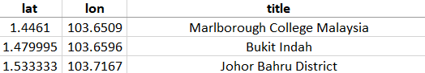
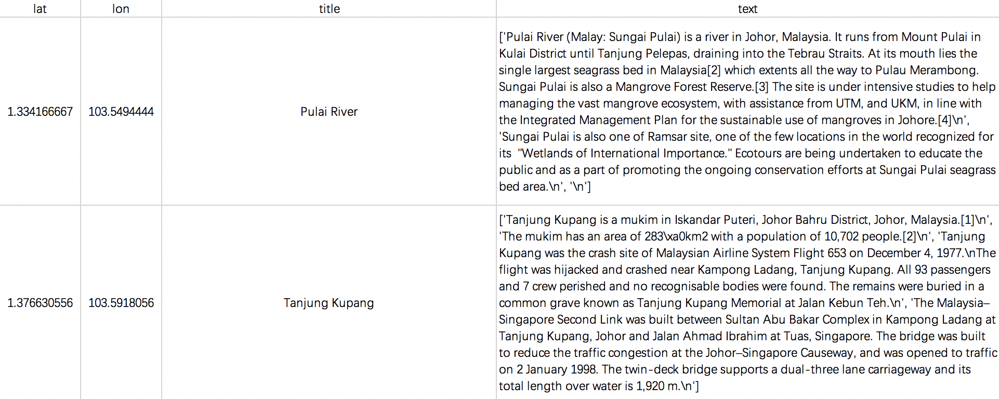

--- 
title: "Explore Wikipedia locations"
author: "Ronnie Liu Nuozhi"
bibliography:
- book.bib
- packages.bib
documentclass: book
link-citations: yes
site: bookdown::bookdown_site
biblio-style: apalike
---

# Exploring Topics of Place and Housing Price

## Introduction

Wikipedia is an online encyclopedia created and maintained as an open collaboration project by volunteer editors. It features exclusively free content and no commercial ads, and is owned and supported by the Wikimedia Foundation, a non-profit organization funded primarily through donations. (Wikipedia Contributors, 2018)

Moreover, Wikipedia is one of the most visited sites on the web, offering a unique, entirely open, collaborative editing process based on contribution from experts and reviewers. The articles and cross-references provide general knowledge of topics. (Medelyan, 2009) Wikipedia contains description of places, becoming neutral reference to understanding the context, instead of involving subjective attachment to specific locations.

This research is inspired by de Palma (de Palma, 2015), whose team addresses the endogenous choice process of employment location, which has correlation to real estate development. In this sense, the proposal targets endogeneity on spatially attributed topics in urban context, considered as part of choosing process. Then, it will explore in-depth relation between topics and housing price by computational methods. 

As part of the quantitative analysis, the methods will scope into Wikipedia content of describing Singapore locations. The objective of research is to differentiate the key information from the impartial description of urban places via quantitative approach, in order to indicate the relation between housing price and different topics of places. 

## Research question and hypothesis

### Hypothesis 

The hypothesis of research is that the different Wikipedia description of urban places have correlation to housing price in Singapore.

### Research question

Do different topics in urban area affect housing price in Singapore?

  **Sub-questions**
  
  - How different between the description of location in Singapore?
  - Will the difference of description be related to housing price?

## Data sources

### Source 1: HDB housing

Singapore HDB housing resale price from course materials. 

### Source 2: Wikipedia

**Data Source**:

The data were retrieved from Media Wiki API (MediaWiki, 2019) which is widely used by varied websites, companies and organizations, including Wikipedia. It is free and open to make knowledge available to people by providing searchable content, so that it is easy to retrieve archived information. 

**Data retrieval**:

1. The first step is to use Geo-search to collect page title which refer to Singapore location. The radius of searching point will be 500 meters and divide Singapore into 4000 points. Once finishing searching and reduce the duplicated titles, there remains 1233 places, with having Wikipedia page, in Singapore. It contains title name, latitude and longitude, as showing in *figure 1*. 

2. The location list can be used for search Wikipedia page content and extract the description of each location. The data sample shows as *figure 2*. 

## Methodology

Initial natural language process will be applied to Wikipedia datasets, including tokenizing and building corpus. To understanding more about the difference on topic of the articles, a topic model will be applied to dataset. The expected outcome will be location tagged by different topic labels which will be extracted from trained classifiers. 

Later, the data will be transforming into spatial cells. Principle Component Analysis will be used to scale down the data, so that the dimensions of word vectors can be reduced. Then, as further examine the dataset by regression, it will be investigated whether the location tagged by topic with itself is positive or negative autocorrelation. Finally, the spatial regression will be used to understand how much the housing price related to topic-attributed places. 

## Extensions/Limitations

The natural language process will be extended into the research project. The limitation will be the topic tags generated by pre-trained classifiers from other research works. 

------

**Bibliography**

*de Palma, A., Motamedi, K., Picard, N., & Waddell, P.* (2005). A model of residential location choice with endogenous housing prices and traffic for the Paris region.

*MediaWiki.* (2019). Mediawiki.Org. https://www.mediawiki.org/wiki/MediaWiki

*Medelyan, O., Milne, D., Legg, C., & Witten, I. H*. (2009). Mining meaning from Wikipedia. International Journal of Human-Computer Studies, 67(9), 716-754.

*Wikipedia Contributors*. (2018). Wikipedia. Retrieved from Wikipedia website: https://en.wikipedia.org/wiki/Wikipedia