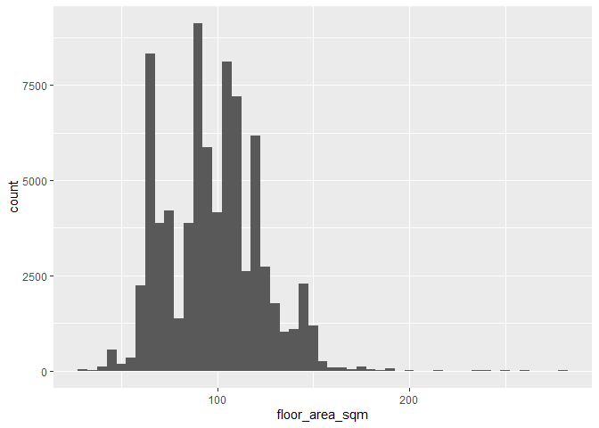
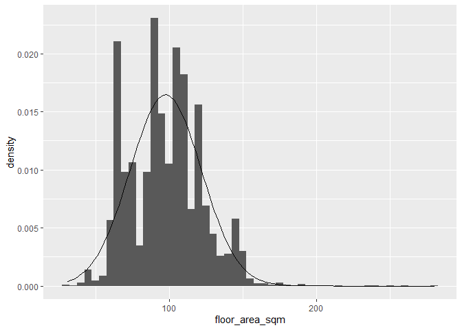
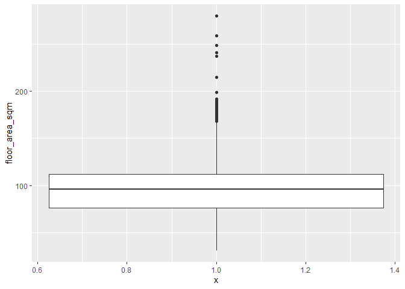
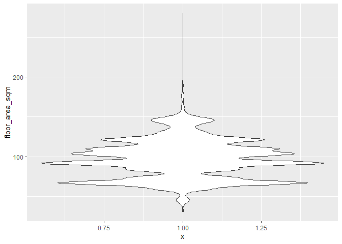
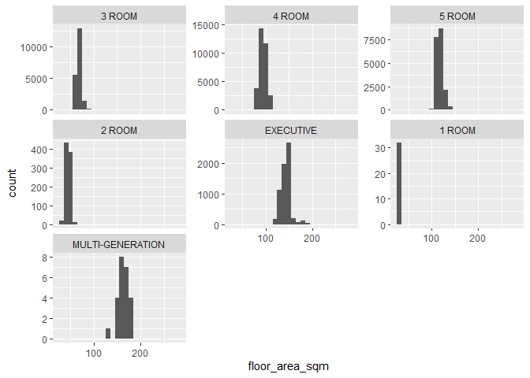
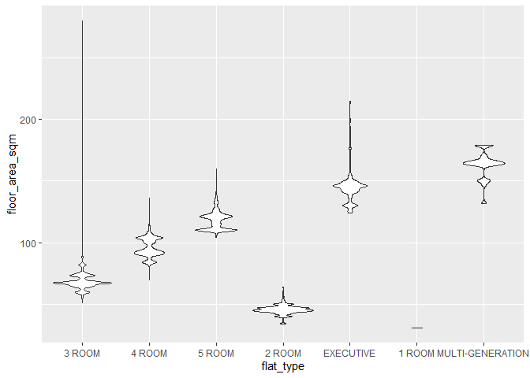

week2
================
Ronnie
2/6/2020

``` r
library(tidyverse)
```

    ## -- Attaching packages ---------------------------------------- tidyverse 1.2.1 --

    ## v ggplot2 3.2.1     v purrr   0.3.2
    ## v tibble  2.1.3     v dplyr   0.8.3
    ## v tidyr   1.0.2     v stringr 1.4.0
    ## v readr   1.3.1     v forcats 0.4.0

    ## Warning: package 'tidyr' was built under R version 3.6.2

    ## -- Conflicts ------------------------------------------- tidyverse_conflicts() --
    ## x dplyr::filter() masks stats::filter()
    ## x dplyr::lag()    masks stats::lag()

``` r
library(lubridate)
```

    ## 
    ## Attaching package: 'lubridate'

    ## The following object is masked from 'package:base':
    ## 
    ##     date

``` r
library(e1071)
```

    ## Warning: package 'e1071' was built under R version 3.6.2

``` r
library(ggplot2)
```

## 3.1 Introduction

``` r
sales <- read_csv(here::here("data/resale-flat-prices-based-on-registration-date-from-jan-2015-onwards.csv")) %>% 
  mutate(month = ymd(month, truncated = 1),
         flat_type = as_factor(flat_type),
         storey_range = as_factor(storey_range),
         flat_model = as_factor(flat_model))
```

    ## Parsed with column specification:
    ## cols(
    ##   month = col_character(),
    ##   town = col_character(),
    ##   flat_type = col_character(),
    ##   block = col_character(),
    ##   street_name = col_character(),
    ##   storey_range = col_character(),
    ##   floor_area_sqm = col_double(),
    ##   flat_model = col_character(),
    ##   lease_commence_date = col_double(),
    ##   remaining_lease = col_double(),
    ##   resale_price = col_double()
    ## )

``` r
saveRDS(sales, here::here("data/sales.rds"))
```

``` r
sales <- readRDS(here::here("data/sales.rds"))
```

## 3.2 Central Tendency

``` r
manual_mode <- function(x, na.rm = FALSE) {
  if(na.rm){
    x = x[!is.na(x)]
  }

  ux <- unique(x)
  return(ux[which.max(tabulate(match(x, ux)))])
}
```

``` r
mean(sales$floor_area_sqm)
```

    ## [1] 97.58903

``` r
median(sales$floor_area_sqm)
```

    ## [1] 96

``` r
manual_mode(sales$floor_area_sqm)
```

    ## [1] 67

## 3.3 Dispersion

``` r
# Range
max(sales$floor_area_sqm) - min(sales$floor_area_sqm)
```

    ## [1] 249

``` r
# Interquartile Range
IQR(sales$floor_area_sqm)
```

    ## [1] 36

``` r
# Standard Deviation
sd(sales$floor_area_sqm)
```

    ## [1] 24.22276

``` r
# Coefficient of variation
sd(sales$floor_area_sqm) / mean(sales$floor_area_sqm)
```

    ## [1] 0.2482119

``` r
# Kurtosis and Skewness from the 'e1071` library
kurtosis(sales$floor_area_sqm)
```

    ## [1] -0.1450646

``` r
skewness(sales$floor_area_sqm)
```

    ## [1] 0.2770161

``` r
summary(sales$floor_area_sqm)
```

    ##    Min. 1st Qu.  Median    Mean 3rd Qu.    Max. 
    ##   31.00   76.00   96.00   97.59  112.00  280.00

``` r
skimr::skim(sales$floor_area_sqm)
```

|                                                  |                        |
| :----------------------------------------------- | :--------------------- |
| Name                                             | sales$floor\_area\_sqm |
| Number of rows                                   | 79100                  |
| Number of columns                                | 1                      |
| \_\_\_\_\_\_\_\_\_\_\_\_\_\_\_\_\_\_\_\_\_\_\_   |                        |
| Column type frequency:                           |                        |
| numeric                                          | 1                      |
| \_\_\_\_\_\_\_\_\_\_\_\_\_\_\_\_\_\_\_\_\_\_\_\_ |                        |
| Group variables                                  | None                   |

Data summary

**Variable type: numeric**

| skim\_variable | n\_missing | complete\_rate |  mean |    sd | p0 | p25 | p50 | p75 | p100 | hist  |
| :------------- | ---------: | -------------: | ----: | ----: | -: | --: | --: | --: | ---: | :---- |
| data           |          0 |              1 | 97.59 | 24.22 | 31 |  76 |  96 | 112 |  280 | ▃▇▁▁▁ |

## 3.4 Visualization

``` r
ggplot(sales, aes(x = floor_area_sqm)) + 
  geom_histogram(binwidth = 5)
```

<!-- -->

``` r
ggplot(sales, aes(x = floor_area_sqm)) + 
  geom_histogram(aes(y = ..density..), binwidth = 5) +
  stat_function(fun = dnorm, args = list(mean = mean(sales$floor_area_sqm), sd = sd(sales$floor_area_sqm)))
```

<!-- -->

``` r
sales %>% 
  filter(floor_area_sqm == 67) %>% 
  View()
```

``` r
ggplot(sales, aes(x = 1, y = floor_area_sqm)) + 
  geom_boxplot()
```

<!-- -->

``` r
ggplot(sales, aes(x = 1, y = floor_area_sqm)) + 
  geom_violin()
```

<!-- -->

``` r
ggplot(sales, aes(x = floor_area_sqm)) + 
  geom_histogram(binwidth = 10) +
  facet_wrap(vars(flat_type), scales = "free_y")
```

<!-- -->

``` r
ggplot(sales, aes(x = flat_type, y = floor_area_sqm)) + 
  geom_violin()
```

<!-- -->
