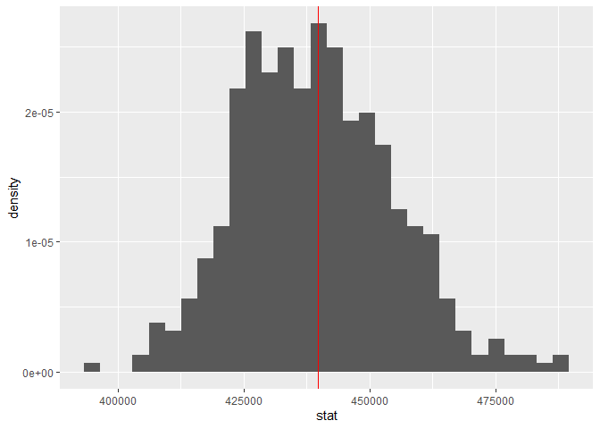
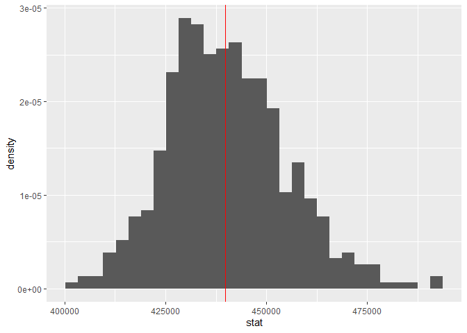

session4
================

  - [Sampling resale transaction](#sampling-resale-transaction)
      - [Population mean method 1](#population-mean-method-1)
      - [Population mean method 2](#population-mean-method-2)
      - [sample mean (n = 1, size = 100)](#sample-mean-n-1-size-100)
      - [sample mean (n = 500, size = 100) / method
        1](#sample-mean-n-500-size-100-method-1)
      - [sample mean (n = 500, size = 100) / method
        2](#sample-mean-n-500-size-100-method-2)
  - [Confidence intervals & boostrap
    resampling](#confidence-intervals-boostrap-resampling)
  - [Comparing means between groups](#comparing-means-between-groups)

``` r
library(tidyverse)
library(infer)
```

## Sampling resale transaction

### Population mean method 1

``` r
sales <- readRDS(here::here("data/sales.rds"))

mu <- sales %>% summarise(stat = mean(resale_price))
mu # mean of population
```

    ## # A tibble: 1 x 1
    ##      stat
    ##     <dbl>
    ## 1 439793.

### Population mean method 2

``` r
sales %>% 
  specify(response = resale_price) %>% 
  calculate(stat = "mean")
```

    ## # A tibble: 1 x 1
    ##      stat
    ##     <dbl>
    ## 1 439793.

### sample mean (n = 1, size = 100)

``` r
# sample mean
sales %>% 
  sample_n(100) %>% 
  summarise(stat = mean(resale_price))
```

    ## # A tibble: 1 x 1
    ##      stat
    ##     <dbl>
    ## 1 455423.

### sample mean (n = 500, size = 100) / method 1

``` r
sample_mean <- function(dataset, sampleSize=100) {
  dataset %>% 
    sample_n(sampleSize) %>% 
    summarise(stat = mean(resale_price))
}

sampled_means <- rerun(500, sample_mean(sales)) %>% bind_rows()
```

``` r
# sample mean for 500 times
sampled_means %>% 
  ggplot() +
  geom_histogram(aes(stat, ..density..)) +
  geom_vline(color = "red", xintercept = mu$stat)
```

    ## `stat_bin()` using `bins = 30`. Pick better value with `binwidth`.

<!-- -->

### sample mean (n = 500, size = 100) / method 2

``` r
resample_500 <- rep_sample_n(sales, 100, reps = 500) # resample for 500 times
sampled_means_500 <- resample_500 %>% 
  group_by(replicate) %>% 
  summarise(stat = mean(resale_price)) # get resample means
```

``` r
sampled_means_500 %>% 
  ggplot() +
  geom_histogram(aes(x = stat, y = ..density..)) +
  geom_vline(color = "red", xintercept = mu$stat)
```

    ## `stat_bin()` using `bins = 30`. Pick better value with `binwidth`.

<!-- -->

## Confidence intervals & boostrap resampling

## Comparing means between groups
