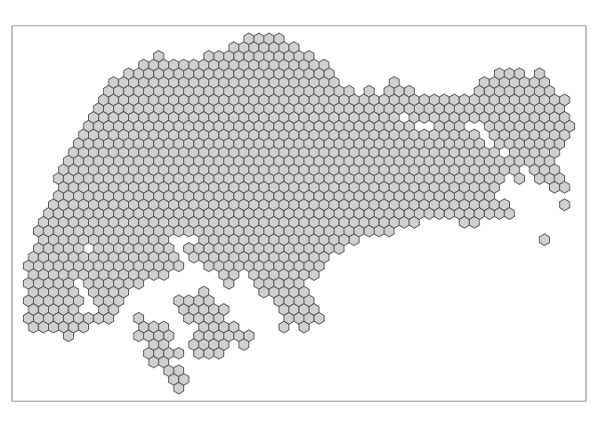
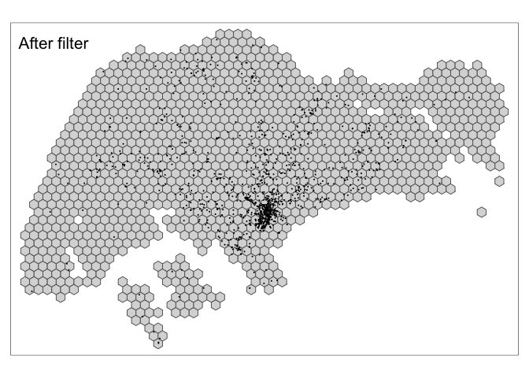
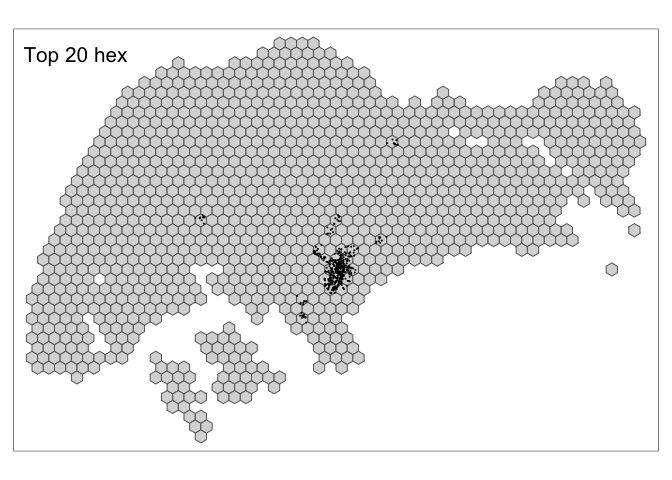
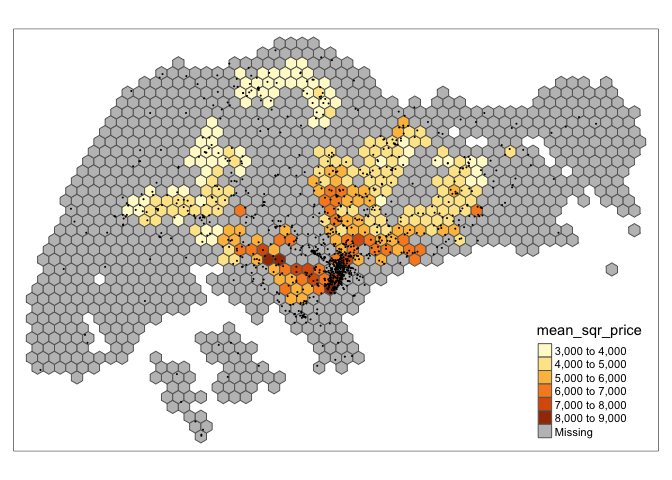
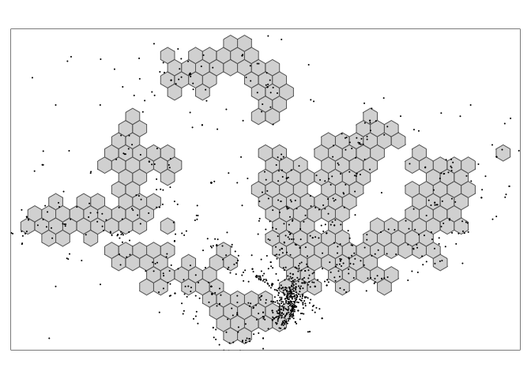

0-prepare-data
================
Ronnie
4/23/2020

``` r
library(tidyverse)
library(tmap)
library(sf)
```

## Wikipedia data

### change singapore to hexagons

The hexagon divides singapre as a unit of 2 km. Each hexagon grid will
be attributed unique id as `hex_id`.

``` r
# singapore 
singapore <- st_read(here::here("project/data/singapore_outline/singapore_outline.shp")) %>% st_transform(crs=4326)
```

    ## Reading layer `singapore_outline' from data source `/Users/yaya/Desktop/Liu/liu-nuozhi/project/data/singapore_outline/singapore_outline.shp' using driver `ESRI Shapefile'
    ## Simple feature collection with 1 feature and 1 field
    ## geometry type:  MULTIPOLYGON
    ## dimension:      XY
    ## bbox:           xmin: 2667.538 ymin: 15748.72 xmax: 56396.44 ymax: 50256.33
    ## proj4string:    +proj=tmerc +lat_0=1.366666666666667 +lon_0=103.8333333333333 +k=1 +x_0=28001.642 +y_0=38744.572 +datum=WGS84 +units=m +no_defs

``` r
# hex
hex <- singapore %>% st_transform(crs = 3414) %>% st_make_grid(cellsize = 1000, square = F) %>% st_transform(crs=4326) %>% st_sf()

hex$hex_id <- hex %>% rownames() 

qtm(hex)
```

<!-- -->

``` r
cat("Length: ", hex %>% nrow())
```

    ## Length:  1141

``` r
glimpse(hex)
```

    ## Rows: 1,141
    ## Columns: 2
    ## $ geometry <POLYGON [°]> POLYGON ((103.6057 1.216125..., POLYGON ((103.6057 1…
    ## $ hex_id   <chr> "1", "2", "3", "4", "5", "6", "7", "8", "9", "10", "11", "12…

### Remove locations outside Singapore

``` r
wiki <- read_csv(here::here("project/data/wiki.csv")) %>% select(-X1)
glimpse(wiki)
```

    ## Rows: 1,233
    ## Columns: 5
    ## $ lat    <dbl> 1.232600, 1.366347, 1.334167, 1.451389, 1.376631, 1.211700, 1.…
    ## $ lon    <dbl> 103.5327, 103.5484, 103.5494, 103.5889, 103.5918, 103.6125, 10…
    ## $ pageid <dbl> 13108718, 1838457, 6170311, 5073671, 5974898, 3956978, 6110331…
    ## $ title  <chr> "Masjid Al-Mawaddah", "Port of Tanjung Pelepas", "Pulai River"…
    ## $ text   <chr> "Masjid Al-Mawaddah  is a mosque located in Sengkang, at the j…

``` r
# wiki -> sf
wiki_sf <- wiki %>% st_as_sf(coords=c("lon", "lat"), crs=4326)

# How many points out of boundary?
wiki_sf_sg <- wiki_sf %>% st_filter(hex) # filter wiki sf

wiki_not_in_boundary <- wiki$title %>% setdiff(wiki_sf_sg$title)
wiki_not_in_boundary %>% length() %>% cat("There are ", ., "points out of the boundary.")
```

    ## There are  93 points out of the boundary.

``` r
map_sg <- tm_shape(hex) + tm_polygons()
map_sg + tm_shape(wiki_sf) + tm_dots() + tm_layout(title = "Before filter")
```

<!-- -->

``` r
map_sg + tm_shape(wiki_sf_sg) + tm_dots() + tm_layout(title = "After filter")
```

<!-- -->

The dataset consists of 1233 wikipedia pages of locations. Each
locations has its geocoordinate, page id, title of the page and the
content of the article. From the glimpse of the data, we can see the
dataset contains 5 columns: `lat`, `lon`, `pageid`, `title`, `text`.
There are 1233 articles in the total datasets.

At very primary look at the dataset, most of locations are close to
central area. There are 108 points may locate in Malaysia which drop
outside of the Singapore boundary. Here filters the dataset which only
includes locations within Singapore. As as result, there are 1140
locations with Wikipedia pages.

### binding points with hex\_id

``` r
wiki_sf_sg <- st_join(wiki_sf_sg, hex)
```

``` r
qtm(hex) + 
wiki_sf_sg %>% 
  count(hex_id, sort = T) %>% 
  top_n(20, n) %>% 
  qtm() + tm_layout(title = "Top 20 hex")
```

<!-- -->

There are 327 hex\_id in total, while only 179 ids have been assigned to
Wiki pages. The plot above shows the top 20 hexagons which contain the
most number of points. From the map, we can see central area has high
density of listed location on Wikipeda. Besides some few hexagons show
other parts Singapore also have relative dense locations on Wikipedia
such as Tampinese, Sengkang and Punngol, Ang Mo Kio, Queestown and
Jurong
    East.

-----

## Housing

### import housing location

``` r
house <- read_rds(here::here("data/resale_with_geom.rds"))
```

### binding housing to hexagon

``` r
house <- st_join(house %>% st_transform(crs = 4326), hex)
```

    ## although coordinates are longitude/latitude, st_intersects assumes that they are planar
    ## although coordinates are longitude/latitude, st_intersects assumes that they are planar

``` r
house_hex <- house %>% st_set_geometry(NULL) %>% group_by(hex_id) %>% 
  summarise(mean_price = mean(resale_price),
            mean_area = mean(floor_area_sqm),
            mean_sqr_price = mean_price / mean_area,
            mean_lease = mean(remaining_lease))

hex %>% left_join(house_hex) %>% tm_shape() + tm_polygons(col = "mean_sqr_price") + 
  wiki_sf_sg %>% 
  count(hex_id, sort = T) %>% 
  qtm()
```

    ## Joining, by = "hex_id"

<!-- -->

## Wiki in conjunction with House

``` r
house_hex <- hex %>% left_join(house_hex) %>% filter(!is.na(mean_sqr_price))
```

    ## Joining, by = "hex_id"

``` r
# wiki_hex <- st_filter(wiki_sf_sg, house_hex)
wiki_hex <- wiki_sf_sg
qtm(house_hex) + qtm(wiki_hex)
```

<!-- -->

Since we need to examine the relation between wiki description and
housing prices. It will require to fill out some locations outsdie the
hexagons of housing. Hence, it will only remain 645 points for the
Wikipedia dataset.

## Export data

``` r
# hex %>% saveRDS(here::here("project/data/rds/hex.rds"))
# wiki_sf_sg %>% saveRDS("./data/wiki_sf_sg.rds") # wiki page with hex id

# house_hex %>% saveRDS(here::here("project/data/house_hex.rds"))
# wiki_hex %>% saveRDS(here::here("project/data/wiki_hex.rds"))
```
