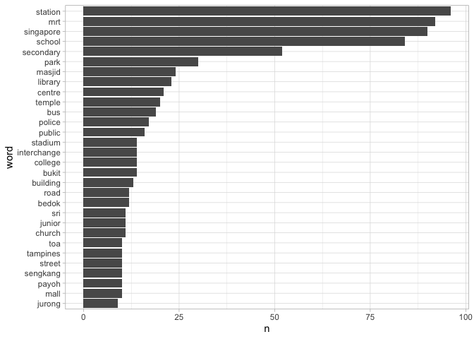

1-EDA
================

``` r
library(tidyverse)
library(tidytext)
library(tmap)
library(sf)
library(textstem)

wiki_hex <- read_rds(here::here("project/data/wiki_hex.rds"))
hex <- read_rds(here::here("project/data/rds/hex.rds"))
```

``` r
theme_light() %>% theme_set()
```

## Tidy text

### A look at titles

``` r
titles <- wiki_hex %>% st_set_geometry(NULL) %>% select(-text)
```

``` r
my_stop_words <- tibble(word = c("station", "school", "mrt", "singapore"))

titles %>% 
  unnest_tokens(word, title) %>% 
  anti_join(stop_words) %>%
  # anti_join(my_stop_words) %>%
  count(word, sort = T) %>% 
  top_n(n=30) %>% 
  mutate(word = fct_reorder(word, n)) %>%
  ggplot(aes(word, n)) +
  geom_col() +
  coord_flip()
```

<!-- -->

From the titles, it can tell most of the locations are about stations
and schools. There are 645 titles, while arount 100 titles are about
stations and mrt, and another about 80 titles are about schools.

### A look at an articles

Here we can take a look a slot of articles. Just take the first passage.

``` r
wiki_text <- wiki_hex %>% st_set_geometry(NULL) # only text
print(wiki_text[1,]$text)
```

    ## [1] "The Officer Cadet School (OCS) is a military school within the SAFTI Military Institute camp complex that trains officers for all three services of the Singapore Armed Forces."

``` r
wiki_text %>% mutate(word_number = lengths(str_split(text, pattern = " "))) %>% arrange(word_number) %>% skimr::skim()
```

|                                                  |            |
| :----------------------------------------------- | :--------- |
| Name                                             | Piped data |
| Number of rows                                   | 645        |
| Number of columns                                | 5          |
| \_\_\_\_\_\_\_\_\_\_\_\_\_\_\_\_\_\_\_\_\_\_\_   |            |
| Column type frequency:                           |            |
| character                                        | 3          |
| numeric                                          | 2          |
| \_\_\_\_\_\_\_\_\_\_\_\_\_\_\_\_\_\_\_\_\_\_\_\_ |            |
| Group variables                                  | None       |

Data summary

**Variable type:
character**

| skim\_variable | n\_missing | complete\_rate | min |   max | empty | n\_unique | whitespace |
| :------------- | ---------: | -------------: | --: | ----: | ----: | --------: | ---------: |
| title          |          0 |              1 |   5 |    60 |     0 |       645 |          0 |
| text           |          0 |              1 |  79 | 80106 |     0 |       645 |          0 |
| hex\_id        |          0 |              1 |   3 |     3 |     0 |       193 |          0 |

**Variable type:
numeric**

| skim\_variable | n\_missing | complete\_rate |       mean |          sd |    p0 |     p25 |     p50 |      p75 |     p100 | hist  |
| :------------- | ---------: | -------------: | ---------: | ----------: | ----: | ------: | ------: | -------: | -------: | :---- |
| pageid         |          0 |              1 | 17103011.5 | 18193193.56 | 27318 | 2590367 | 8511332 | 28390930 | 63144025 | ▇▂▂▁▂ |
| word\_number   |          0 |              1 |      603.9 |      833.83 |    13 |     202 |     361 |      700 |    12469 | ▇▁▁▁▁ |

``` r
wiki_text %>% mutate(word_number = lengths(str_split(text, pattern = " "))) %>% 
  ggplot() + geom_histogram(aes(x = word_number, y = ..density..))
```

    ## `stat_bin()` using `bins = 30`. Pick better value with `binwidth`.

<!-- -->

With skimming at the dataset, each articles contains 604 words in
averrage. 50% of articles are over 360 words.

### Tokenizations & Lemmatization & POS tagging

``` r
tokens <- wiki_text %>% group_by(hex_id) %>% 
  unnest_tokens(word, text) %>% 
  anti_join(stop_words) %>% ungroup() %>%
  mutate(word = lemmatize_words(word)) %>%  # lemmatize 
  inner_join(parts_of_speech) # pos tag
glimpse(tokens)
```

    ## Rows: 335,644
    ## Columns: 5
    ## $ pageid <dbl> 7481491, 7481491, 7481491, 7481491, 7481491, 7481491, 7481491,…
    ## $ title  <chr> "Officer Cadet School (Singapore)", "Officer Cadet School (Sin…
    ## $ hex_id <chr> "167", "167", "167", "167", "167", "167", "167", "167", "167",…
    ## $ word   <chr> "officer", "officer", "cadet", "school", "school", "school", "…
    ## $ pos    <chr> "Noun", "Verb (transitive)", "Noun", "Noun", "Verb (transitive…

### Tokens & Pos summary

``` r
skimr::skim(tokens)
```

|                                                  |        |
| :----------------------------------------------- | :----- |
| Name                                             | tokens |
| Number of rows                                   | 335644 |
| Number of columns                                | 5      |
| \_\_\_\_\_\_\_\_\_\_\_\_\_\_\_\_\_\_\_\_\_\_\_   |        |
| Column type frequency:                           |        |
| character                                        | 4      |
| numeric                                          | 1      |
| \_\_\_\_\_\_\_\_\_\_\_\_\_\_\_\_\_\_\_\_\_\_\_\_ |        |
| Group variables                                  | None   |

Data summary

**Variable type:
character**

| skim\_variable | n\_missing | complete\_rate | min | max | empty | n\_unique | whitespace |
| :------------- | ---------: | -------------: | --: | --: | ----: | --------: | ---------: |
| title          |          0 |           1.00 |   5 |  60 |     0 |       645 |          0 |
| hex\_id        |          0 |           1.00 |   3 |   3 |     0 |       193 |          0 |
| word           |          0 |           1.00 |   1 |  20 |     0 |     10485 |          0 |
| pos            |       5108 |           0.98 |   4 |  21 |     0 |        13 |          0 |

**Variable type:
numeric**

| skim\_variable | n\_missing | complete\_rate |     mean |       sd |    p0 |     p25 |     p50 |      p75 |     p100 | hist  |
| :------------- | ---------: | -------------: | -------: | -------: | ----: | ------: | ------: | -------: | -------: | :---- |
| pageid         |          0 |              1 | 12991388 | 15984754 | 27318 | 1994475 | 4747762 | 17044907 | 63144025 | ▇▂▁▁▁ |

``` r
### Token
# token (freq > 1) count in total
tokens %>%
  count(word, sort = TRUE) %>% filter(n > 1)%>% nrow() %>% cat("There are ", ., "tokens (freq > 1).")
```

    ## There are  7711 tokens (freq > 1).

``` r
tokens %>%
  count(word, sort = TRUE) %>% filter(n > 1) %>% 
  ggplot(aes(n, ..density..)) + geom_histogram() + 
  labs(title = "tokens frequency (> 1)")
```

<!-- -->

``` r
### Pos tag
# How the pos tag distributed?
tokens %>% 
  ggplot(aes(fct_infreq(pos))) + 
  geom_bar() + 
  coord_flip() +
  labs(x = "pos tag", title = "POS tag frequency")
```

<!-- -->

``` r
# What is the most occurrin words?
tokens %>%
  count(word, sort = TRUE) %>% 
  top_n(n=30) %>% 
  mutate(word = fct_reorder(word, n)) %>%
  ggplot(aes(word, n)) +
  geom_col() +
  coord_flip() + 
  labs(x = "word", 
       title = "Top 30 frequent words")
```

<!-- -->

``` r
# What is the most occurrin adhectuve or adverb?
tokens %>% 
  filter(pos == "Adjective" |
         pos == "Adverb") %>% 
  count(word, sort = TRUE) %>% 
  top_n(n=30) %>% 
  mutate(word = fct_reorder(word, n)) %>%
  ggplot(aes(word, n)) +
  geom_col() +
  coord_flip() + 
  labs(x = "Adj. / Adv.",
       title = "Most frequent adjective/ adverb")
```

<!-- -->

With tokenizing and lemmatizing all the articles, there are 212257 words
without excluding stopwords. After remove stop words, there are 10485
unique words remaining. There are 7711 words only occur once in the
tokens (remaining 9695).

From the top 30 words, we can see the word `singapore` and `singapore's`
take a large proportion of the data. Some key words shows significant
ranks such as `school`, `station`, `road`, `park`, `centre`.

``` r
key_word_filter = function(kw) {
  d <- hex %>% left_join(tokens %>% filter(word == kw) %>% group_by(hex_id) %>% count(word, sort = TRUE))
  
  tm_shape(d) + tm_polygons(col = "n") + tm_layout(title = kw)
}

key_word_filter("singapore")
```

<!-- -->

``` r
key_word_filter("school")
```

<!-- -->

``` r
key_word_filter("station")
```

<!-- -->

``` r
key_word_filter("road")
```

<!-- -->

``` r
key_word_filter("park")
```

<!-- -->

``` r
key_word_filter("centre")
```

<!-- -->

``` r
key_word_filter("design")
```

<!-- -->

``` r
key_word_filter("national")
```

<!-- -->

``` r
key_word_filter("chinese")
```

<!-- -->

``` r
key_word_filter("public")
```

<!-- -->

### N-gram

**Bigram**

``` r
bigrams <- wiki_text %>% group_by(hex_id) %>% 
  unnest_tokens(bigram, text, token="ngrams", n = 2) %>% ungroup()

bigrams %>% separate(bigram, c("word1", "word2"), sep = " ") %>% 
  filter(!word1 %in% stop_words$word) %>% 
  filter(!word2 %in% stop_words$word) %>% 
  unite(bigram, word1, word2, sep=" ") %>% 
  count(bigram, sort = T) %>% 
  top_n(30) %>% 
  ggplot(aes(x = fct_reorder(bigram, n), y = n)) + geom_col() +
  coord_flip() +
  labs(title = "Bigram Top 30", x = "Bigram")
```

    ## Selecting by n

<!-- -->

We can see the relation between two words via `n-gram`.

It captures the phrase intead just breaking into two different tokens.
Here gives the phrase like “pink dot”, “junior college”, “speakers
corner”, “mrt station” and so on. While some terms like “Ang Mo Kio”,
“Lee Kuan Yew” consisting of three words has been mistaken, since the
bigram just capture two words and giving “chu kang”, “kuan yew” and “lee
kuan”.

``` r
trigrams <- wiki_text %>% group_by(hex_id) %>% 
  unnest_tokens(trigram, text, token="ngrams", n = 3, , n_min=1) %>% ungroup()
  
trigrams_filter <- trigrams %>% 
  separate(trigram, c("word1", "word2", "word3"), sep = " ") %>% 
  filter(!word1 %in% stop_words$word,
         !word2 %in% stop_words$word,
         !word3 %in% stop_words$word) %>% 
  mutate(word2 = replace_na(word2, "")) %>% 
  mutate(word3 = replace_na(word3, ""))
```

    ## Warning: Expected 3 pieces. Missing pieces filled with `NA` in 788235 rows [1,
    ## 2, 4, 5, 7, 8, 10, 11, 13, 14, 16, 17, 19, 20, 22, 23, 25, 26, 28, 29, ...].

``` r
trigrams_filter %>% filter(word2 != "", word3 != "") %>% count(word1, word2, word3, sort=T)
```

    ## # A tibble: 39,257 x 4
    ##    word1     word2     word3           n
    ##    <chr>     <chr>     <chr>       <int>
    ##  1 singapore cambridge gce           225
    ##  2 ang       mo        kio           126
    ##  3 cambridge gce       normal        106
    ##  4 gce       normal    level         105
    ##  5 mass      rapid     transit       103
    ##  6 normal    level     examination   102
    ##  7 gce       ordinary  level         100
    ##  8 cambridge gce       ordinary       95
    ##  9 rapid     transit   mrt            82
    ## 10 choa      chu       kang           74
    ## # … with 39,247 more rows

``` r
trigrams_united <- trigrams_filter %>% 
  unite(gram, word1, word2, word3, sep=" ") %>% 
  mutate(
    gram = str_trim(gram)
  )
trigrams_united %>% count(gram, sort=T) %>% 
  mutate(len = lengths(str_split(gram, " "))) %>% 
  filter(len == 3) %>% 
    top_n(30, n) %>% 
    ggplot(aes(x = fct_reorder(gram, n), y = n)) + geom_col() +
    coord_flip() +
    labs(title = "Trigram Top 30", x = "Trigram")
```

<!-- -->

**Trigram**

It makes more sense to have trigram which gives us some term “ang mo
kio”, “central business district”, “choa chu kang” and so on.

``` r
# trigrams_united %>% saveRDS("./data/trigram.rds")
```
