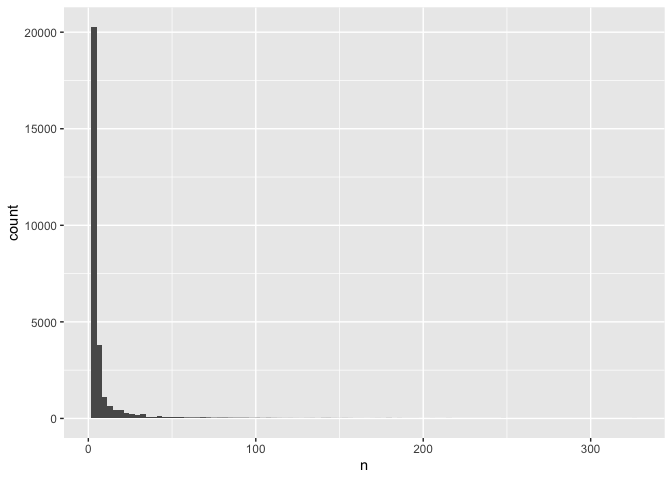
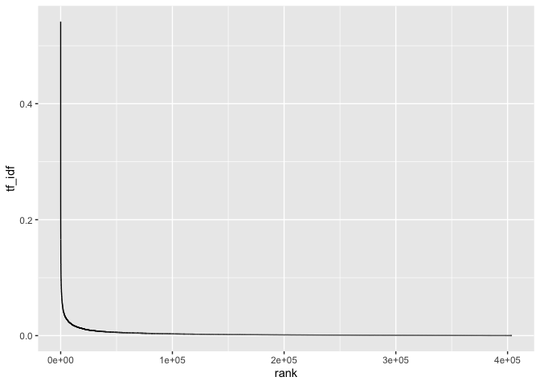
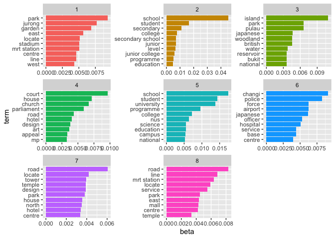
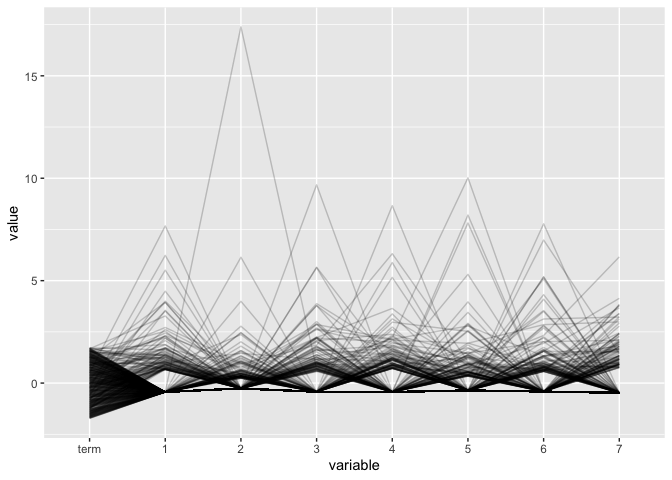
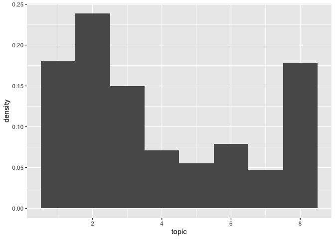
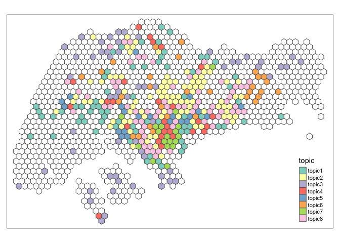

2-topic-models
================
Ronnie
4/22/2020

``` r
library(tidyverse)
library(tidytext)
library(topicmodels)
library(broom)
library(GGally)
library(tm)
library(sf)
library(tmap)
```

``` r
trigram <- read_rds(here::here("project/data/trigram.rds"))
token <- read_rds(here::here("project/data/token.rds"))
```

## Corpus

``` r
word_count <- trigram %>% count(hex_id, gram, sort = T)
dtm <- cast_dtm(data = word_count,
         term = gram,
         document = hex_id,
         value = n)
dtm_tidy <- tidy(dtm)

my_stop_words <- tibble(term = c("building", "build", "street", "singapore", "mrt", "station", "mass rapid", "rapid transit", "singapore's", "transit mrt", "underground mass", "school's", "bus", "interchange", "marina", "bay"))

term_more_then_two <-  dtm_tidy %>% count(term) %>% filter(n > 1) %>% pluck("term")

dtm_tidy %>% 
  filter(term %in% term_more_then_two) %>% # remove term only appear once
  filter(!str_detect(term, "\\d")) %>% # filter number
  anti_join(my_stop_words) %>% 
  count(term, sort = T) %>%
  ggplot(aes(n)) + 
  geom_histogram(bins = 100)
```

<!-- -->

``` r
dtm_clean <- dtm_tidy %>% 
  filter(term %in% term_more_then_two) %>% # remove term only appear once
  filter(!str_detect(term, "\\d")) %>% # filter number
  anti_join(my_stop_words)

dtm_clean %>% count(term, sort = T)
```

    ## # A tibble: 28,654 x 2
    ##    term        n
    ##    <chr>   <int>
    ##  1 locate    325
    ##  2 include   248
    ##  3 road      247
    ##  4 house     216
    ##  5 serve     214
    ##  6 start     206
    ##  7 land      196
    ##  8 service   192
    ##  9 centre    190
    ## 10 park      187
    ## # … with 28,644 more rows

``` r
dtm <- dtm_clean %>% cast_dtm(document, term, count)
```

``` r
### TF-IDF
tfidf <- bind_tf_idf(tbl = dtm_tidy,
            term = term,
            document = document,
            n = count) %>% 
  arrange(desc(tf_idf))

tfidf %>% 
  mutate(rank = row_number()) %>% 
  ggplot(aes(rank, tf_idf)) +
  geom_line()
```

<!-- -->

``` r
k <- 8
wiki_lda <- LDA(dtm, k = k, control = list(seed = 1234))
wiki_lda
```

    ## A LDA_VEM topic model with 8 topics.

``` r
top_terms <- tidy(wiki_lda, matrix="beta") %>% 
  group_by(topic) %>% 
  top_n(10, beta) %>% 
  ungroup() %>% 
  arrange(topic, -beta)

top_terms %>%
  mutate(term = reorder_within(term, beta, topic)) %>%
  ggplot(aes(term, beta, fill = factor(topic))) +
  geom_col(show.legend = FALSE) +
  facet_wrap(~ topic, scales = "free") +
  coord_flip() +
  scale_x_reordered()
```

<!-- -->

``` r
top_terms <- tidy(wiki_lda, matrix="beta") %>% 
  group_by(topic) %>% 
  top_n(100, beta) %>% 
  ungroup() %>% 
  arrange(topic, -beta)

top_terms %>% pivot_wider(
  names_from = topic, values_from = beta
) %>% 
  replace(is.na(.), 0) %>%  
  ggparcoord(., columns = 1:k, alpha = 0.2)
```

<!-- -->

``` r
assignments <- augment(wiki_lda, data = dtm)
assignments <- assignments %>% select(document, .topic) %>% distinct(document, .keep_all = T)
colnames(assignments)[2] <- "topic"
```

``` r
assignments %>% 
  ggplot() +
  geom_histogram(aes(x=topic, y=..density..),
                 binwidth = 1)
```

<!-- -->

``` r
wiki_hex <- read_rds(here::here("project/data/wiki_hex.rds"))
topics_hex <- read_rds(here::here("project/data/topic.rds"))
hex <- read_rds(here::here("project/data/rds/hex.rds"))

tm_shape(hex) + tm_polygons(col = "#ffffff") +
hex %>% left_join(topics_hex, by = c("hex_id" = "document")) %>% 
  filter(!is.na(topic)) %>% 
  mutate(topic = paste0("topic", topic)) %>% 
  tm_shape() + tm_polygons(col = "topic") 
```

<!-- -->

``` r
# + tm_shape(wiki_hex %>% select(-pageid)) + tm_dots(alpha=0.5)
```

``` r
# assignments %>% saveRDS(here::here("project/data/topic.rds"))
```
